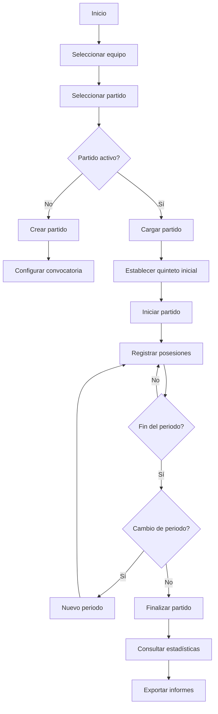
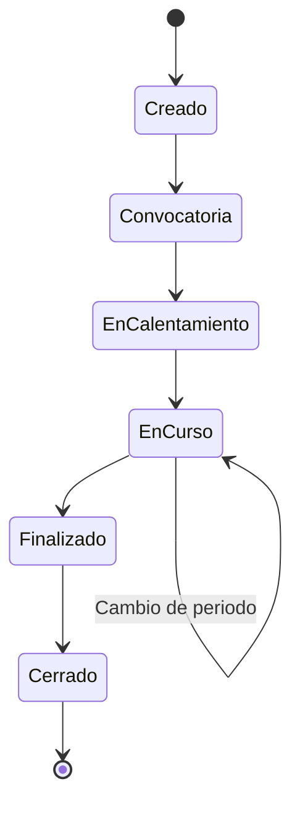

# Especificación Funcional del Módulo de Análisis de Partidos

Versión 1.0

---

## 1. Introducción

### 1.1 Objetivo

Este documento define la especificación funcional del módulo de análisis de partidos de la aplicación.

El objetivo del módulo es permitir registrar, analizar y explotar toda la información generada durante un partido de baloncesto mediante un sistema basado en posesiones.

No pretende ser un sistema estadístico clásico basado únicamente en tiros, rebotes o pérdidas.

La filosofía del módulo consiste en registrar únicamente la información mínima necesaria para reconstruir posteriormente cualquier estadística o informe.

Todo el sistema estará diseñado alrededor de la posesión.

### 1.2 Filosofía

Existen dos formas habituales de analizar un partido.

**Modelo clásico**

Registrar acciones:
- tiro
- rebote
- pérdida
- asistencia

Este modelo genera muchas estadísticas pero muy poco contexto.

**Modelo basado en posesiones**

Registrar cada posesión indicando únicamente la información necesaria para describir cómo ha terminado.

Esta filosofía permite obtener posteriormente:
- PPP
- Offensive Rating
- Defensive Rating
- frecuencia de sistemas
- eficiencia por quintetos
- eficiencia por jugadora
- eficiencia por tipo de ataque
- eficiencia por rival
- tendencias
- informes automáticos

Toda la aplicación se desarrollará siguiendo este segundo enfoque.

---

## 2. Objetivos del módulo

El módulo deberá permitir:
- registrar partidos
- registrar convocatorias
- registrar quintetos iniciales
- registrar cambios
- registrar posesiones ofensivas
- registrar posesiones defensivas
- registrar anotaciones
- consultar estadísticas
- comparar partidos
- comparar temporadas
- comparar rivales

---

## 3. Principios de diseño

### 3.1 La posesión es la unidad de información

Todo gira alrededor de la posesión.

Nunca alrededor del tiro.

Nunca alrededor del rebote.

Nunca alrededor de la asistencia.

Las estadísticas siempre serán información derivada.

### 3.2 Todo debe ser configurable

No existirán listas fijas.

Todos los catálogos podrán modificarse.

Ejemplos:
- sistemas
- tipos de ataque
- tipos de defensa
- etiquetas
- resultados
- botones
- atajos
- colores
- informes

Cada entrenador podrá definir completamente su forma de trabajar.

### 3.3 Configuración por equipo

Un entrenador puede entrenar varios equipos.

Cada equipo tendrá:
- sistemas distintos
- etiquetas distintas
- plantillas distintas
- informes distintos
- configuración distinta

La configuración nunca será global.

### 3.4 Registro extremadamente rápido

El objetivo es registrar una posesión completa en menos de cinco segundos.

Para conseguirlo:
- botones grandes
- mínimo número de pulsaciones
- atajos de teclado
- componentes reutilizables
- valores por defecto
- autocompletado

### 3.5 Escalabilidad

El módulo debe soportar futuras funcionalidades sin modificar el modelo de datos.

Ejemplos:
- vídeo
- IA
- generación de informes
- scouting
- clips automáticos
- sincronización con marcador
- exportaciones

---

## 4. Unidad principal: la posesión

Una posesión representa una secuencia de juego comprendida entre la obtención del balón y la pérdida de la posesión.

Una posesión puede pertenecer:
- a nuestro equipo
- al rival

La estructura será la misma.

### Información mínima de una posesión

| Campo | Descripción |
|-------|-------------|
| periodo | Número de periodo |
| número | Número de posesión |
| tipo de inicio | Cómo se obtiene la posesión |
| tipo de ataque | Contraataque, transición, estático... |
| sistema | Sistema utilizado (opcional) |
| finalizadora | Jugadora que finaliza |
| generadora | Jugadora que genera ventaja (opcional) |
| resultado | T2 anotado, T2 fallado, pérdida... |
| puntos | Puntos obtenidos |
| rango temporal | 0-8, 9-16, 17-24 segundos |
| observaciones | Notas libres |
| etiquetas | Tags configurables |

### Rango temporal

No se almacenarán segundos reales.

El usuario elegirá una de estas opciones:
- 0-8 segundos
- 9-16 segundos
- 17-24 segundos

Este enfoque evita errores derivados de la velocidad de captura y mantiene un gran valor estadístico.

---

## 5. Quintetos

No se almacenará el quinteto en cada posesión.

Únicamente:
- quinteto inicial
- cambios

El quinteto activo se reconstruirá automáticamente para cualquier instante del partido.

Ventajas:
- evita inconsistencias
- simplifica el registro
- reduce almacenamiento
- facilita estadísticas por quinteto

---

## 6. Eventos

Las posesiones podrán contener eventos.

Los eventos no serán obligatorios.

Ejemplos:
- bloqueo directo
- mano a mano
- corte
- rebote ofensivo
- robo
- falta

En una primera versión la captura podrá realizarse únicamente con el resultado final.

Posteriormente podrán añadirse eventos sin modificar la base de datos.

---

## 7. Configuración dinámica

La aplicación no debe contener listas codificadas.

Todos los elementos serán configurables.

### Sistemas

- Horns
- Flex
- Spain
- Delay
- (configurables por equipo)

### Tipos de ataque

- Contraataque
- Transición
- Estático
- Saque
- Rebote ofensivo

### Resultados

- T2 anotado
- T2 fallado
- T3 anotado
- T3 fallado
- Pérdida
- Falta recibida
- Final de periodo

### Etiquetas

Cada entrenador podrá crear las que considere necesarias.

No existirá límite.

---

## 8. Plataforma

El módulo deberá funcionar igual de bien en:
- ordenador
- tablet

Y en dos modos de trabajo:
- análisis en directo
- análisis mediante vídeo

La interfaz deberá adaptarse automáticamente al dispositivo.

---

## 9. Requisitos no funcionales

- Muy rápido
- Escalable
- Componentes reutilizables
- Código desacoplado
- Arquitectura basada en dominio
- Compatible con futuras funcionalidades
- Totalmente configurable

---

## 10. Criterios de aceptación

El módulo estará correctamente implementado cuando sea posible:
- registrar un partido completo
- registrar cambios
- registrar todas las posesiones
- consultar estadísticas
- añadir nuevos sistemas sin modificar código
- añadir nuevos tipos de ataque sin modificar código
- añadir nuevas etiquetas sin modificar código
- utilizar el mismo motor para cualquier equipo

---

## 11. Decisiones de arquitectura

Las siguientes decisiones se consideran definitivas para el proyecto:
- La posesión será la unidad de información
- No se almacenarán quintetos en cada posesión
- Todo será configurable
- Las estadísticas serán siempre información derivada
- La arquitectura priorizará la extensibilidad sobre la simplicidad inicial
- La interfaz estará optimizada para registrar información con el menor número posible de pulsaciones

---

## 12. Interfaces del sistema

### 12.1 Actores

- Entrenador principal
- Entrenador ayudante
- Analista

### 12.2 Casos de uso principales

1. Gestionar equipos
2. Gestionar jugadoras
3. Gestionar temporadas
4. Gestionar competiciones
5. Configurar catálogos
6. Crear partido
7. Gestionar convocatoria
8. Establecer quinteto inicial
9. Registrar cambios
10. Registrar posesiones
11. Consultar estadísticas
12. Comparar datos
13. Exportar informes

---

## 13. Diagrama de flujo general



---

## 14. Gestión de equipos

### 14.1 Funcionalidades

- Crear equipo
- Editar equipo
- Desactivar equipo
- Configurar equipo (sistemas, tags, resultados)
- Gestionar temporadas

### 14.2 Datos del equipo

| Campo | Tipo | Descripción |
|-------|------|-------------|
| id | UUID | Identificador único |
| nombre | string | Nombre del equipo |
| categoria | string | Categoría o edad |
| temporada_activa | UUID | Temporada actual |
| config | JSONB | Configuración específica |
| activo | boolean | Equipo activo |

---

## 15. Gestión de jugadoras

### 15.1 Funcionalidades

- Añadir jugadora
- Editar jugadora
- Desactivar jugadora
- Asignar número de camiseta
- Asignar posición

### 15.2 Datos de jugadora

| Campo | Tipo | Descripción |
|-------|------|-------------|
| id | UUID | Identificador único |
| nombre | string | Nombre completo |
| numero | integer | Número de camiseta |
| posicion | string | Posición (base, escolta, alero, pívot) |
| equipo_id | UUID | Equipo al que pertenece |
| activa | boolean | Jugadora activa |

---

## 16. Gestión de partidos

### 16.1 Ciclo de vida del partido



### 16.2 Datos del partido

| Campo | Tipo | Descripción |
|-------|------|-------------|
| id | UUID | Identificador único |
| equipo_id | UUID | Equipo local |
| rival | string | Nombre del rival |
| competicion | string | Competición |
| jornada | string | Jornada |
| fecha | date | Fecha del partido |
| lugar | string | Local o visitante |
| periodo_actual | integer | Periodo en curso |
| estado | string | Estado del partido |
| resultado_local | integer | Puntos propios |
| resultado_visitante | integer | Puntos rival |

---

## 17. Modelo de posesión detallado

### 17.1 Atributos

| Campo | Tipo | Obligatorio | Descripción |
|-------|------|-------------|-------------|
| id | UUID | Sí | Identificador único |
| partido_id | UUID | Sí | Partido al que pertenece |
| periodo | integer | Sí | Número de periodo |
| numero | integer | Sí | Número de posesión en el partido |
| lado | string | Sí | own / rival |
| tipo_inicio | string | Sí | Cómo se obtiene: saque, rebote_def, robo, tiro_libre... |
| tipo_ataque_id | UUID | Sí | Tipo de ataque |
| sistema_id | UUID | No | Sistema utilizado |
| resultado_id | UUID | Sí | Resultado de la posesión |
| finalizadora_id | UUID | No | Jugadora que finaliza |
| generadora_id | UUID | No | Jugadora que genera ventaja |
| rango_temporal | string | Sí | 0-8, 9-16, 17-24 |
| puntos | integer | Sí | Puntos obtenidos |
| observaciones | text | No | Notas libres |
| tags | text[] | No | Etiquetas |

### 17.2 Reglas de validación

- No puede existir una posesión sin partido
- El periodo debe ser >= 1
- El número debe ser secuencial
- El lado debe ser own o rival
- El tipo de inicio debe existir en configuración
- El tipo de ataque debe existir en configuración
- El resultado debe existir en configuración
- Los puntos deben ser 0, 1, 2, 3 o 4
- El rango temporal debe ser uno de los valores permitidos

---

## 18. Gestión de cambios y sustituciones

### 18.1 Funcionalidades

- Registrar cambio
- Deshacer cambio
- Ver historial de cambios
- Reconstruir quinteto en cualquier instante

### 18.2 Datos del cambio

| Campo | Tipo | Descripción |
|-------|------|-------------|
| id | UUID | Identificador único |
| partido_id | UUID | Partido |
| jugadora_sale | UUID | Jugadora que abandona |
| jugadora_entra | UUID | Jugadora que ingresa |
| periodo | integer | Periodo del cambio |
| orden_cambio | integer | Orden dentro del periodo |
| instante | string | Marcador o tiempo |

---

## 19. Exportación de datos

### 19.1 Formatos soportados

- CSV
- Excel
- PDF
- JSON

### 19.2 Datos exportables

- Posesiones completas
- Estadísticas por partido
- Estadísticas por jugadora
- Estadísticas por sistema
- Estadísticas por quinteto
- Informes de scouting

---

## 20. Glosario

| Término | Definición |
|---------|------------|
| Posesión | Secuencia desde que se obtiene el balón hasta que se pierde |
| PPP | Puntos por posesión |
| Offensive Rating | Puntos anotados por cada 100 posesiones |
| Defensive Rating | Puntos recibidos por cada 100 posesiones |
| Finalizadora | Jugadora que realiza el último gesto de ataque |
| Generadora | Jugadora que crea la ventaja que permite finalizar |
| Quinteto | Conjunto de cinco jugadoras en pista |
| Rango temporal | Tiempo transcurrido desde el inicio de la posesión |
| Tag | Etiqueta configurable para clasificar posesiones |

---

## 21. Anexos

### 21.1 Ejemplo de flujo de registro

```text
Partido: Jornada 5 - Cáceres vs Badajoz
Periodo: 1
Posesión 1: Saque -> Contraataque -> T2 anotado (Jugadora 7) -> 2 puntos
Posesión 2: Rebote defensivo -> Estático -> Horns -> Pérdida
Posesión 3: Saque de fondo -> Transición -> Spain -> T3 anotado (Jugadora 12) -> 3 puntos
```

### 21.2 Ejemplo de dashboard

```text
┌──────────────────────────────────────────────┐
│  PARTIDO: CÁCERES vs BADAJOZ                   │
│  Periodo: 1  |  Posesiones: 15                  │
│  Local: 28  |  Visitante: 22                     │
├──────────────────────────────────────────────┤
│  PPP Ofensivo: 1.24                              │
│  PPP Defensivo: 1.05                             │
│  ORtg: 124  |  DRtg: 105                         │
├──────────────────────────────────────────────┤
│  Sistemas más usados:                              │
│  Horns: 5 posesiones (33%) - PPP: 1.40          │
│  Flex: 3 posesiones (20%) - PPP: 1.00           │
│  Spain: 2 posesiones (13%) - PPP: 1.50          │
└──────────────────────────────────────────────┘
```

---

## 22. Próximo documento

[02-modelo-datos-supabase.md](02-modelo-datos-supabase.md)
