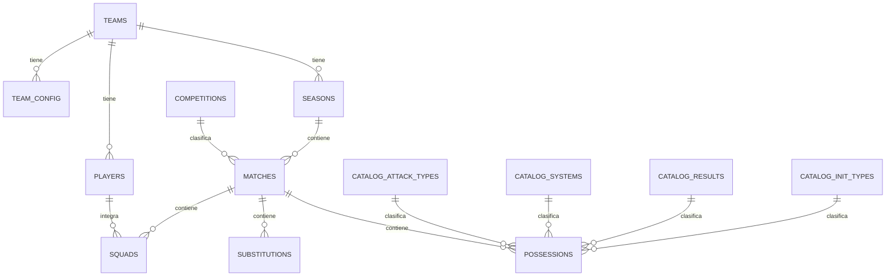
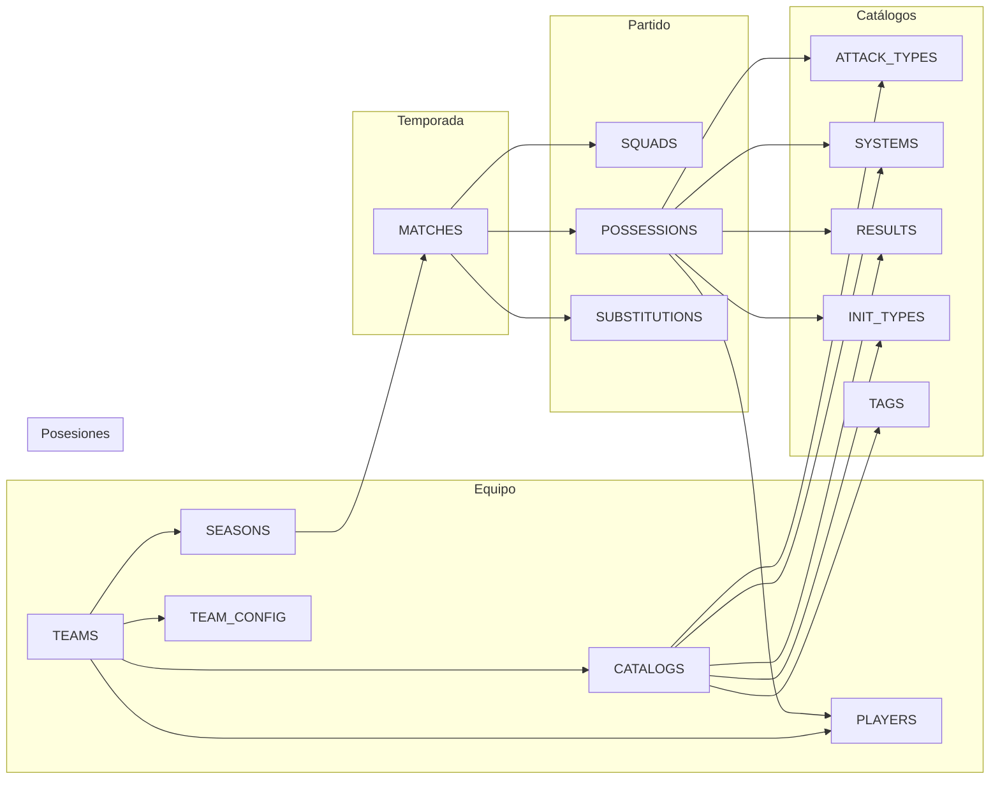

# Modelo de Datos Supabase

Versión 1.0

---

## 1. Objetivo

Este documento define el esquema completo de la base de datos PostgreSQL en Supabase para la aplicación de análisis de partidos de baloncesto basado en posesiones.

---

## 2. Principios de diseño

- La tabla principal es `possessions`
- Nunca almacenar estadísticas calculadas
- Los catálogos son dinámicos y están en la base de datos
- No usar ENUMs para lógica de negocio configurable
- Usar UUIDs como claves primarias
- Soft delete para datos críticos
- Auditoría de cambios importantes

---

## 3. Esquema general



---

## 4. Tablas del sistema

### 4.1 teams

```sql
CREATE TABLE teams (
    id UUID PRIMARY KEY DEFAULT gen_random_uuid(),
    name TEXT NOT NULL,
    category TEXT,
    logo_url TEXT,
    active BOOLEAN DEFAULT true,
    created_at TIMESTAMPTZ DEFAULT now(),
    updated_at TIMESTAMPTZ DEFAULT now()
);
```

### 4.2 seasons

```sql
CREATE TABLE seasons (
    id UUID PRIMARY KEY DEFAULT gen_random_uuid(),
    team_id UUID NOT NULL REFERENCES teams(id) ON DELETE CASCADE,
    name TEXT NOT NULL,
    start_date DATE,
    end_date DATE,
    active BOOLEAN DEFAULT false,
    created_at TIMESTAMPTZ DEFAULT now(),
    updated_at TIMESTAMPTZ DEFAULT now()
);
```

### 4.3 competitions

```sql
CREATE TABLE competitions (
    id UUID PRIMARY KEY DEFAULT gen_random_uuid(),
    name TEXT NOT NULL,
    team_id UUID NOT NULL REFERENCES teams(id) ON DELETE CASCADE,
    season_id UUID NOT NULL REFERENCES seasons(id) ON DELETE CASCADE,
    created_at TIMESTAMPTZ DEFAULT now()
);
```

### 4.4 players

```sql
CREATE TABLE players (
    id UUID PRIMARY KEY DEFAULT gen_random_uuid(),
    team_id UUID NOT NULL REFERENCES teams(id) ON DELETE CASCADE,
    name TEXT NOT NULL,
    number INTEGER,
    position TEXT,
    active BOOLEAN DEFAULT true,
    created_at TIMESTAMPTZ DEFAULT now(),
    updated_at TIMESTAMPTZ DEFAULT now()
);
```

### 4.5 matches

```sql
CREATE TABLE matches (
    id UUID PRIMARY KEY DEFAULT gen_random_uuid(),
    team_id UUID NOT NULL REFERENCES teams(id) ON DELETE CASCADE,
    season_id UUID NOT NULL REFERENCES seasons(id) ON DELETE CASCADE,
    competition_id UUID REFERENCES competitions(id),
    rival TEXT NOT NULL,
    round TEXT,
    location TEXT,
    date DATE NOT NULL,
    status TEXT DEFAULT 'created',
    current_period INTEGER DEFAULT 1,
    score_own INTEGER DEFAULT 0,
    score_rival INTEGER DEFAULT 0,
    start_time TIMESTAMPTZ,
    end_time TIMESTAMPTZ,
    created_at TIMESTAMPTZ DEFAULT now(),
    updated_at TIMESTAMPTZ DEFAULT now()
);

CREATE INDEX idx_matches_team_season ON matches(team_id, season_id);
CREATE INDEX idx_matches_date ON matches(date DESC);
```

### 4.6 squads

```sql
CREATE TABLE squads (
    id UUID PRIMARY KEY DEFAULT gen_random_uuid(),
    match_id UUID NOT NULL REFERENCES matches(id) ON DELETE CASCADE,
    player_id UUID NOT NULL REFERENCES players(id) ON DELETE CASCADE,
    starter BOOLEAN DEFAULT false,
    created_at TIMESTAMPTZ DEFAULT now(),
    UNIQUE(match_id, player_id)
);
```

### 4.7 possessions

```sql
CREATE TABLE possessions (
    id UUID PRIMARY KEY DEFAULT gen_random_uuid(),
    match_id UUID NOT NULL REFERENCES matches(id) ON DELETE CASCADE,
    period INTEGER NOT NULL,
    number INTEGER NOT NULL,
    side TEXT NOT NULL CHECK (side IN ('own', 'rival')),
    init_type_id UUID NOT NULL REFERENCES catalog_init_types(id),
    attack_type_id UUID NOT NULL REFERENCES catalog_attack_types(id),
    system_id UUID REFERENCES catalog_systems(id),
    result_id UUID NOT NULL REFERENCES catalog_results(id),
    finisher_id UUID REFERENCES players(id),
    creator_id UUID REFERENCES players(id),
    time_bucket TEXT NOT NULL CHECK (time_bucket IN ('0-8', '9-16', '17-24')),
    points INTEGER NOT NULL DEFAULT 0,
    notes TEXT,
    tags TEXT[] DEFAULT '{}',
    deleted BOOLEAN DEFAULT false,
    created_at TIMESTAMPTZ DEFAULT now(),
    updated_at TIMESTAMPTZ DEFAULT now()
);

CREATE INDEX idx_possessions_match ON possessions(match_id);
CREATE INDEX idx_possessions_match_period ON possessions(match_id, period);
CREATE INDEX idx_possessions_side ON possessions(match_id, side);
CREATE INDEX idx_possessions_system ON possessions(system_id);
CREATE INDEX idx_possessions_attack ON possessions(attack_type_id);
```

### 4.8 substitutions

```sql
CREATE TABLE substitutions (
    id UUID PRIMARY KEY DEFAULT gen_random_uuid(),
    match_id UUID NOT NULL REFERENCES matches(id) ON DELETE CASCADE,
    player_out UUID NOT NULL REFERENCES players(id),
    player_in UUID NOT NULL REFERENCES players(id),
    period INTEGER NOT NULL,
    order_in_period INTEGER NOT NULL,
    created_at TIMESTAMPTZ DEFAULT now()
);

CREATE INDEX idx_substitutions_match ON substitutions(match_id);
CREATE INDEX idx_substitutions_period ON substitutions(match_id, period);
```

---

## 5. Catálogos configurables

### 5.1 catalog_attack_types

```sql
CREATE TABLE catalog_attack_types (
    id UUID PRIMARY KEY DEFAULT gen_random_uuid(),
    team_id UUID NOT NULL REFERENCES teams(id) ON DELETE CASCADE,
    name TEXT NOT NULL,
    short_name TEXT,
    color TEXT DEFAULT '#6366f1',
    sort_order INTEGER DEFAULT 0,
    active BOOLEAN DEFAULT true,
    created_at TIMESTAMPTZ DEFAULT now()
);

CREATE UNIQUE INDEX idx_catalog_attack_types_team_name
    ON catalog_attack_types(team_id, name);
```

### 5.2 catalog_systems

```sql
CREATE TABLE catalog_systems (
    id UUID PRIMARY KEY DEFAULT gen_random_uuid(),
    team_id UUID NOT NULL REFERENCES teams(id) ON DELETE CASCADE,
    name TEXT NOT NULL,
    short_name TEXT,
    color TEXT DEFAULT '#8b5cf6',
    sort_order INTEGER DEFAULT 0,
    active BOOLEAN DEFAULT true,
    created_at TIMESTAMPTZ DEFAULT now()
);

CREATE UNIQUE INDEX idx_catalog_systems_team_name
    ON catalog_systems(team_id, name);
```

### 5.3 catalog_results

```sql
CREATE TABLE catalog_results (
    id UUID PRIMARY KEY DEFAULT gen_random_uuid(),
    team_id UUID NOT NULL REFERENCES teams(id) ON DELETE CASCADE,
    name TEXT NOT NULL,
    short_name TEXT,
    points INTEGER NOT NULL DEFAULT 0,
    is_miss BOOLEAN DEFAULT false,
    is_turnover BOOLEAN DEFAULT false,
    is_foul_drawn BOOLEAN DEFAULT false,
    color TEXT DEFAULT '#10b981',
    sort_order INTEGER DEFAULT 0,
    active BOOLEAN DEFAULT true,
    created_at TIMESTAMPTZ DEFAULT now()
);

CREATE UNIQUE INDEX idx_catalog_results_team_name
    ON catalog_results(team_id, name);
```

### 5.4 catalog_init_types

```sql
CREATE TABLE catalog_init_types (
    id UUID PRIMARY KEY DEFAULT gen_random_uuid(),
    team_id UUID NOT NULL REFERENCES teams(id) ON DELETE CASCADE,
    name TEXT NOT NULL,
    short_name TEXT,
    color TEXT DEFAULT '#f59e0b',
    sort_order INTEGER DEFAULT 0,
    active BOOLEAN DEFAULT true,
    created_at TIMESTAMPTZ DEFAULT now()
);

CREATE UNIQUE INDEX idx_catalog_init_types_team_name
    ON catalog_init_types(team_id, name);
```

### 5.5 catalog_tags

```sql
CREATE TABLE catalog_tags (
    id UUID PRIMARY KEY DEFAULT gen_random_uuid(),
    team_id UUID NOT NULL REFERENCES teams(id) ON DELETE CASCADE,
    name TEXT NOT NULL,
    color TEXT DEFAULT '#6b7280',
    active BOOLEAN DEFAULT true,
    created_at TIMESTAMPTZ DEFAULT now()
);

CREATE UNIQUE INDEX idx_catalog_tags_team_name
    ON catalog_tags(team_id, name);
```

### 5.6 team_config

```sql
CREATE TABLE team_config (
    id UUID PRIMARY KEY DEFAULT gen_random_uuid(),
    team_id UUID UNIQUE NOT NULL REFERENCES teams(id) ON DELETE CASCADE,
    config JSONB NOT NULL DEFAULT '{}',
    created_at TIMESTAMPTZ DEFAULT now(),
    updated_at TIMESTAMPTZ DEFAULT now()
);
```

---

## 6. Valores por defecto (seed data)

```sql
-- Tipos de inicio por defecto
INSERT INTO catalog_init_types (team_id, name, short_name, color, sort_order)
SELECT t.id, v.name, v.short_name, v.color, v.sort_order
FROM teams t
CROSS JOIN (VALUES
    ('Saque inicial', 'SI', '#f59e0b', 1),
    ('Saque de fondo', 'SF', '#f59e0b', 2),
    ('Rebote defensivo', 'RD', '#f59e0b', 3),
    ('Rebote ofensivo', 'RO', '#f59e0b', 4),
    ('Robo', 'RB', '#f59e0b', 5),
    ('Tiro libre', 'TL', '#f59e0b', 6)
) AS v(name, short_name, color, sort_order);

-- Tipos de ataque por defecto
INSERT INTO catalog_attack_types (team_id, name, short_name, color, sort_order)
SELECT t.id, v.name, v.short_name, v.color, v.sort_order
FROM teams t
CROSS JOIN (VALUES
    ('Contraataque', 'CA', '#6366f1', 1),
    ('Transición', 'TR', '#6366f1', 2),
    ('Estático', 'ES', '#6366f1', 3),
    ('Saque', 'SQ', '#6366f1', 4),
    ('Rebote ofensivo', 'RO', '#6366f1', 5)
) AS v(name, short_name, color, sort_order);

-- Resultados por defecto
INSERT INTO catalog_results (team_id, name, short_name, points, is_miss, is_turnover, is_foul_drawn, color, sort_order)
SELECT t.id, v.*
FROM teams t
CROSS JOIN (VALUES
    ('T2 anotado', '2P', 2, false, false, false, '#10b981', 1),
    ('T2 fallado', '2F', 0, true, false, false, '#ef4444', 2),
    ('T3 anotado', '3P', 3, false, false, false, '#10b981', 3),
    ('T3 fallado', '3F', 0, true, false, false, '#ef4444', 4),
    ('TL anotado', 'TL+', 1, false, false, false, '#10b981', 5),
    ('TL fallado', 'TL-', 0, true, false, false, '#ef4444', 6),
    ('Pérdida', 'PER', 0, false, true, false, '#ef4444', 7),
    ('Falta recibida', 'FAL', 0, false, false, true, '#3b82f6', 8),
    ('Final periodo', 'FP', 0, false, false, false, '#6b7280', 9)
) AS v(name, short_name, points, is_miss, is_turnover, is_foul_drawn, color, sort_order);

-- Sistemas por defecto
INSERT INTO catalog_systems (team_id, name, short_name, color, sort_order)
SELECT t.id, v.name, v.short_name, v.color, v.sort_order
FROM teams t
CROSS JOIN (VALUES
    ('Horns', 'HR', '#8b5cf6', 1),
    ('Flex', 'FX', '#8b5cf6', 2),
    ('Spain', 'SP', '#8b5cf6', 3),
    ('Delay', 'DL', '#8b5cf6', 4),
    ('Motion', 'MT', '#8b5cf6', 5),
    ('Dribble Drive', 'DD', '#8b5cf6', 6),
    ('Pick and Roll', 'PNR', '#8b5cf6', 7),
    ('Aclarado', 'AC', '#8b5cf6', 8)
) AS v(name, short_name, color, sort_order);
```

---

## 7. Vistas

### 7.1 v_match_summary

```sql
CREATE VIEW v_match_summary AS
SELECT
    m.id AS match_id,
    m.team_id,
    m.rival,
    m.date,
    m.status,
    m.score_own,
    m.score_rival,
    COUNT(p.id) FILTER (WHERE p.side = 'own' AND NOT p.deleted) AS own_possessions,
    COUNT(p.id) FILTER (WHERE p.side = 'rival' AND NOT p.deleted) AS rival_possessions,
    COALESCE(SUM(p.points) FILTER (WHERE p.side = 'own' AND NOT p.deleted), 0) AS own_points,
    COALESCE(SUM(p.points) FILTER (WHERE p.side = 'rival' AND NOT p.deleted), 0) AS rival_points,
    ROUND(
        COALESCE(SUM(p.points) FILTER (WHERE p.side = 'own' AND NOT p.deleted), 0)::numeric /
        NULLIF(COUNT(p.id) FILTER (WHERE p.side = 'own' AND NOT p.deleted), 0), 2
    ) AS own_ppp,
    ROUND(
        COALESCE(SUM(p.points) FILTER (WHERE p.side = 'rival' AND NOT p.deleted), 0)::numeric /
        NULLIF(COUNT(p.id) FILTER (WHERE p.side = 'rival' AND NOT p.deleted), 0), 2
    ) AS rival_ppp
FROM matches m
LEFT JOIN possessions p ON p.match_id = m.id AND NOT p.deleted
GROUP BY m.id;
```

### 7.2 v_player_stats

```sql
CREATE VIEW v_player_stats AS
SELECT
    p.id AS player_id,
    p.name AS player_name,
    p.number,
    p.team_id,
    COUNT(poss.id) FILTER (WHERE poss.side = 'own' AND NOT poss.deleted) AS own_possessions,
    SUM(poss.points) FILTER (WHERE poss.side = 'own' AND NOT poss.deleted) AS total_points,
    ROUND(
        COALESCE(SUM(poss.points) FILTER (WHERE poss.side = 'own' AND NOT poss.deleted), 0)::numeric /
        NULLIF(COUNT(poss.id) FILTER (WHERE poss.side = 'own' AND NOT poss.deleted), 0), 2
    ) AS ppp,
    COUNT(poss.id) FILTER (
        WHERE poss.side = 'own' AND NOT poss.deleted
        AND EXISTS (SELECT 1 FROM catalog_results cr WHERE cr.id = poss.result_id AND cr.is_miss = false AND cr.points > 0)
    ) AS made_shots,
    COUNT(poss.id) FILTER (
        WHERE poss.side = 'own' AND NOT poss.deleted
        AND EXISTS (SELECT 1 FROM catalog_results cr WHERE cr.id = poss.result_id AND cr.is_turnover = true)
    ) AS turnovers,
    COUNT(poss.id) FILTER (WHERE poss.creator_id = p.id AND poss.side = 'own' AND NOT poss.deleted) AS creations
FROM players p
LEFT JOIN possessions poss ON (poss.finisher_id = p.id OR poss.creator_id = p.id)
GROUP BY p.id, p.name, p.number, p.team_id;
```

---

## 8. Funciones

### 8.1 Reconstruir quinteto

```sql
CREATE OR REPLACE FUNCTION get_active_lineup(
    p_match_id UUID,
    p_period INTEGER,
    p_possession_number INTEGER
) RETURNS TABLE (player_id UUID, player_name TEXT, number INTEGER)
LANGUAGE plpgsql
AS $$
BEGIN
    RETURN QUERY
    WITH starting_five AS (
        SELECT s.player_id
        FROM squads s
        WHERE s.match_id = p_match_id AND s.starter = true
    ),
    substitutions_before AS (
        SELECT
            s.player_out,
            s.player_in,
            s.order_in_period
        FROM substitutions s
        WHERE s.match_id = p_match_id
          AND (s.period < p_period
            OR (s.period = p_period AND s.order_in_period <= p_possession_number))
    ),
    player_changes AS (
        SELECT player_id, SUM(cnt) AS net_change
        FROM (
            SELECT player_out AS player_id, -1 AS cnt
            FROM substitutions_before
            UNION ALL
            SELECT player_in AS player_id, 1 AS cnt
            FROM substitutions_before
        ) changes
        GROUP BY player_id
    )
    SELECT
        pl.id,
        pl.name,
        pl.number
    FROM starting_five sf
    JOIN players pl ON pl.id = sf.player_id
    LEFT JOIN player_changes pc ON pc.player_id = sf.player_id
    WHERE (pc.net_change IS NULL OR pc.net_change >= 0)
    UNION
    SELECT
        pl.id,
        pl.name,
        pl.number
    FROM player_changes pc
    JOIN players pl ON pl.id = pc.player_id
    WHERE pc.net_change > 0;
END;
$$;
```

### 8.2 Obtener estadísticas por sistema

```sql
CREATE OR REPLACE FUNCTION get_stats_by_system(
    p_match_id UUID,
    p_side TEXT DEFAULT 'own'
) RETURNS TABLE (
    system_name TEXT,
    possessions_count BIGINT,
    total_points BIGINT,
    ppp NUMERIC,
    made_count BIGINT,
    turnover_count BIGINT
)
LANGUAGE plsql
AS $$
BEGIN
    RETURN QUERY
    SELECT
        cs.name,
        COUNT(p.id),
        SUM(p.points),
        ROUND(COALESCE(SUM(p.points), 0)::numeric / NULLIF(COUNT(p.id), 0), 2),
        COUNT(CASE WHEN cr.points > 0 AND NOT cr.is_turnover THEN 1 END),
        COUNT(CASE WHEN cr.is_turnover THEN 1 END)
    FROM possessions p
    JOIN catalog_systems cs ON cs.id = p.system_id
    JOIN catalog_results cr ON cr.id = p.result_id
    WHERE p.match_id = p_match_id
      AND p.side = p_side
      AND NOT p.deleted
      AND p.system_id IS NOT NULL
    GROUP BY cs.name
    ORDER BY COUNT(p.id) DESC;
END;
$$;
```

---

## 9. Políticas RLS

```sql
-- Habilitar RLS en todas las tablas
ALTER TABLE teams ENABLE ROW LEVEL SECURITY;
ALTER TABLE seasons ENABLE ROW LEVEL SECURITY;
ALTER TABLE players ENABLE ROW LEVEL SECURITY;
ALTER TABLE matches ENABLE ROW LEVEL SECURITY;
ALTER TABLE possessions ENABLE ROW LEVEL SECURITY;
ALTER TABLE substitutions ENABLE ROW LEVEL SECURITY;
ALTER TABLE squads ENABLE ROW LEVEL SECURITY;
ALTER TABLE catalog_attack_types ENABLE ROW LEVEL SECURITY;
ALTER TABLE catalog_systems ENABLE ROW LEVEL SECURITY;
ALTER TABLE catalog_results ENABLE ROW LEVEL SECURITY;
ALTER TABLE catalog_init_types ENABLE ROW LEVEL SECURITY;
ALTER TABLE catalog_tags ENABLE ROW LEVEL SECURITY;

-- Política: usuarios solo ven sus equipos
CREATE POLICY user_teams ON teams
    FOR ALL USING (
        id IN (
            SELECT team_id FROM team_members WHERE user_id = auth.uid()
        )
    );

-- Política: lectura de posesiones del equipo
CREATE POLICY read_possessions ON possessions
    FOR SELECT USING (
        match_id IN (
            SELECT id FROM matches WHERE team_id IN (
                SELECT team_id FROM team_members WHERE user_id = auth.uid()
            )
        )
    );

-- Política: inserción de posesiones del equipo
CREATE POLICY insert_possessions ON possessions
    FOR INSERT WITH CHECK (
        match_id IN (
            SELECT id FROM matches WHERE team_id IN (
                SELECT team_id FROM team_members WHERE user_id = auth.uid()
            )
        )
    );
```

---

## 10. Tabla de miembros del equipo

```sql
CREATE TABLE team_members (
    id UUID PRIMARY KEY DEFAULT gen_random_uuid(),
    team_id UUID NOT NULL REFERENCES teams(id) ON DELETE CASCADE,
    user_id UUID NOT NULL REFERENCES auth.users(id) ON DELETE CASCADE,
    role TEXT NOT NULL DEFAULT 'coach',
    created_at TIMESTAMPTZ DEFAULT now(),
    UNIQUE(team_id, user_id)
);
```

---

## 11. Tabla de auditoría

```sql
CREATE TABLE audit_log (
    id UUID PRIMARY KEY DEFAULT gen_random_uuid(),
    user_id UUID REFERENCES auth.users(id),
    action TEXT NOT NULL,
    table_name TEXT NOT NULL,
    record_id UUID,
    old_values JSONB,
    new_values JSONB,
    created_at TIMESTAMPTZ DEFAULT now()
);

CREATE INDEX idx_audit_log_user ON audit_log(user_id);
CREATE INDEX idx_audit_log_table ON audit_log(table_name);
CREATE INDEX idx_audit_log_created ON audit_log(created_at DESC);
```

---

## 12. Triggers

```sql
-- Actualizar updated_at automáticamente
CREATE OR REPLACE FUNCTION update_updated_at_column()
RETURNS TRIGGER AS $$
BEGIN
    NEW.updated_at = now();
    RETURN NEW;
END;
$$ LANGUAGE plpgsql;

CREATE TRIGGER update_teams_updated_at
    BEFORE UPDATE ON teams
    FOR EACH ROW EXECUTE FUNCTION update_updated_at_column();

CREATE TRIGGER update_players_updated_at
    BEFORE UPDATE ON players
    FOR EACH ROW EXECUTE FUNCTION update_updated_at_column();

CREATE TRIGGER update_matches_updated_at
    BEFORE UPDATE ON matches
    FOR EACH ROW EXECUTE FUNCTION update_updated_at_column();

CREATE TRIGGER update_possessions_updated_at
    BEFORE UPDATE ON possessions
    FOR EACH ROW EXECUTE FUNCTION update_updated_at_column();

-- Auditoría de posesiones
CREATE OR REPLACE FUNCTION audit_possession_change()
RETURNS TRIGGER AS $$
BEGIN
    INSERT INTO audit_log (user_id, action, table_name, record_id, old_values, new_values)
    VALUES (
        auth.uid(),
        TG_OP,
        'possessions',
        COALESCE(NEW.id, OLD.id),
        CASE WHEN TG_OP = 'DELETE' THEN row_to_json(OLD)::jsonb ELSE NULL END,
        CASE WHEN TG_OP = 'INSERT' THEN row_to_json(NEW)::jsonb
             WHEN TG_OP = 'UPDATE' THEN row_to_json(NEW)::jsonb
             ELSE NULL END
    );
    RETURN COALESCE(NEW, OLD);
END;
$$ LANGUAGE plpgsql SECURITY DEFINER;

CREATE TRIGGER audit_possessions
    AFTER INSERT OR UPDATE OR DELETE ON possessions
    FOR EACH ROW EXECUTE FUNCTION audit_possession_change();
```

---

## 13. Relaciones entre tablas



---

## 14. Notas sobre índices

- Índices compuestos en posesiones por consultas frecuentes
- Índices en catálogos por equipo y nombre para búsquedas únicas
- Índices en auditoría por usuario y fecha
- Índices en partidos por equipo y temporada

---

## 15. Consideraciones de rendimiento

- Las vistas pueden convertirse en materializadas si el volumen de datos crece
- Las funciones de agregación pueden optimizarse con índices parciales
- Los catálogos se cachean en memoria en la aplicación
- Las consultas de estadísticas se ejecutan contra vistas, no contra tablas raw

---

## Próximo documento

[03-arquitectura-angular.md](03-arquitectura-angular.md)
