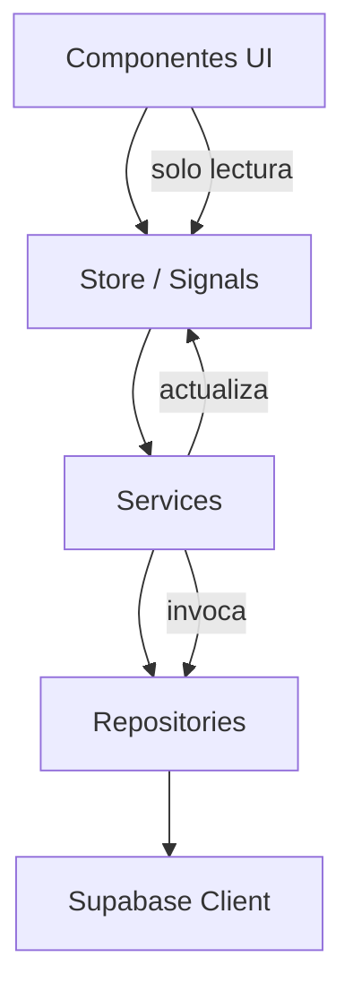

# Arquitectura Angular

Versión 1.0

---

## 1. Objetivo

Definir la arquitectura de la aplicación Angular para el módulo de análisis de partidos.

La arquitectura debe garantizar:
- Escalabilidad
- Mantenibilidad
- Reutilización
- Separación de responsabilidades
- Facilidad de testing

---

## 2. Principios

- Standalone Components
- Angular Signals para estado
- Lazy Loading
- OnPush Change Detection
- Arquitectura por dominios (no por tipo)

---

## 3. Estructura de directorios

```
src/
├── app/
│   ├── core/
│   │   ├── guards/
│   │   ├── interceptors/
│   │   ├── services/
│   │   └── utils/
│   │
│   ├── shared/
│   │   ├── components/
│   │   ├── directives/
│   │   ├── pipes/
│   │   ├── models/
│   │   └── ui/
│   │
│   ├── features/
│   │   ├── auth/
│   │   ├── teams/
│   │   ├── players/
│   │   ├── matches/
│   │   ├── possessions/
│   │   ├── statistics/
│   │   ├── configuration/
│   │   └── dashboard/
│   │
│   └── app.routes.ts
│
├── environments/
└── assets/
```

---

## 4. Estructura por feature

Cada feature sigue el mismo patrón:

```
features/
└── matches/
    ├── pages/
    │   ├── match-list.page.ts
    │   ├── match-detail.page.ts
    │   └── match-live.page.ts
    │
    ├── components/
    │   ├── match-card/
    │   ├── match-form/
    │   ├── scoreboard/
    │   ├── period-selector/
    │   └── match-timeline/
    │
    ├── services/
    │   └── match.service.ts
    │
    ├── repositories/
    │   └── match.repository.ts
    │
    ├── store/
    │   └── match.store.ts
    │
    └── models/
        └── match.model.ts
```

---

## 5. Capas y responsabilidades



### Componentes

Responsabilidades:
- Mostrar información
- Capturar eventos del usuario
- No contienen lógica de negocio
- No acceden directamente a Supabase

### Stores

Responsabilidades:
- Mantener estado de la aplicación
- Exponer Signals de solo lectura
- Recibir acciones de los servicios
- Actualizar estado mediante signals

### Services

Responsabilidades:
- Contener toda la lógica de negocio
- Validar datos antes de enviar
- Coordinar múltiples repositorios
- Calcular estadísticas
- Reconstruir quintetos

### Repositories

Responsabilidades:
- Únicamente acceder a Supabase
- No contienen lógica de negocio
- Devuelven datos sin transformar
- Manejan errores de conexión

---

## 6. Angular Signals

### 6.1 Store base

```typescript
import { signal, computed, Injectable } from '@angular/core';

@Injectable({ providedIn: 'root' })
export class MatchStore {
  private readonly matchSignal = signal<Match | null>(null);
  private readonly possessionsSignal = signal<Possession[]>([]);
  private readonly substitutionsSignal = signal<Substitution[]>([]);
  private readonly loadingSignal = signal<boolean>(false);
  private readonly errorSignal = signal<string | null>(null);

  readonly match = this.matchSignal.asReadonly();
  readonly possessions = this.possessionsSignal.asReadonly();
  readonly substitutions = this.substitutionsSignal.asReadonly();
  readonly loading = this.loadingSignal.asReadonly();
  readonly error = this.errorSignal.asReadonly();

  readonly score = computed(() => {
    const possessions = this.possessionsSignal();
    return {
      own: possessions
        .filter(p => p.side === 'own')
        .reduce((sum, p) => sum + p.points, 0),
      rival: possessions
        .filter(p => p.side === 'rival')
        .reduce((sum, p) => sum + p.points, 0),
    };
  });

  readonly possessionCount = computed(() => ({
    own: this.possessionsSignal().filter(p => p.side === 'own').length,
    rival: this.possessionsSignal().filter(p => p.side === 'rival').length,
  }));

  readonly ppp = computed(() => {
    const possessions = this.possessionsSignal();
    const ownPoss = possessions.filter(p => p.side === 'own');
    const ownPoints = ownPoss.reduce((sum, p) => sum + p.points, 0);
    return ownPoss.length > 0 ? +(ownPoints / ownPoss.length).toFixed(2) : 0;
  });

  setMatch(match: Match): void {
    this.matchSignal.set(match);
  }

  setPossessions(possessions: Possession[]): void {
    this.possessionsSignal.set(possessions);
  }

  addPossession(possession: Possession): void {
    this.possessionsSignal.update(prev => [...prev, possession]);
  }

  updatePossession(id: string, changes: Partial<Possession>): void {
    this.possessionsSignal.update(prev =>
      prev.map(p => (p.id === id ? { ...p, ...changes } : p))
    );
  }

  removePossession(id: string): void {
    this.possessionsSignal.update(prev =>
      prev.map(p => (p.id === id ? { ...p, deleted: true } : p))
    );
  }

  undoLastPossession(): void {
    this.possessionsSignal.update(prev => prev.slice(0, -1));
  }

  setLoading(loading: boolean): void {
    this.loadingSignal.set(loading);
  }

  setError(error: string | null): void {
    this.errorSignal.set(error);
  }

  reset(): void {
    this.matchSignal.set(null);
    this.possessionsSignal.set([]);
    this.substitutionsSignal.set([]);
    this.loadingSignal.set(false);
    this.errorSignal.set(null);
  }
}
```

---

## 7. Repository pattern

```typescript
import { Injectable } from '@angular/core';
import { supabase } from '@core/utils/supabase-client';
import type { Match } from './match.model';

@Injectable({ providedIn: 'root' })
export class MatchRepository {
  async findById(id: string): Promise<Match | null> {
    const { data, error } = await supabase
      .from('matches')
      .select('*')
      .eq('id', id)
      .single();

    if (error) throw error;
    return data;
  }

  async findByTeam(teamId: string, seasonId?: string): Promise<Match[]> {
    let query = supabase
      .from('matches')
      .select('*')
      .eq('team_id', teamId)
      .order('date', { ascending: false });

    if (seasonId) {
      query = query.eq('season_id', seasonId);
    }

    const { data, error } = await query;
    if (error) throw error;
    return data ?? [];
  }

  async create(match: Omit<Match, 'id'>): Promise<Match> {
    const { data, error } = await supabase
      .from('matches')
      .insert(match)
      .select()
      .single();

    if (error) throw error;
    return data;
  }

  async update(id: string, changes: Partial<Match>): Promise<Match> {
    const { data, error } = await supabase
      .from('matches')
      .update(changes)
      .eq('id', id)
      .select()
      .single();

    if (error) throw error;
    return data;
  }

  async softDelete(id: string): Promise<void> {
    const { error } = await supabase
      .from('matches')
      .update({ deleted: true })
      .eq('id', id);

    if (error) throw error;
  }
}
```

---

## 8. Service layer

```typescript
import { Injectable, inject } from '@angular/core';
import { MatchRepository } from '../repositories/match.repository';
import { MatchStore } from '../store/match.store';
import { PossessionRepository } from '../repositories/possession.repository';
import { SubstitutionRepository } from '../repositories/substitution.repository';
import type { Match } from '../models/match.model';
import type { ServiceResult } from '@shared/models/service-result.model';

@Injectable({ providedIn: 'root' })
export class MatchService {
  private readonly matchRepo = inject(MatchRepository);
  private readonly possessionRepo = inject(PossessionRepository);
  private readonly substitutionRepo = inject(SubstitutionRepository);
  private readonly store = inject(MatchStore);

  async loadMatch(id: string): Promise<ServiceResult<Match>> {
    this.store.setLoading(true);
    try {
      const match = await this.matchRepo.findById(id);
      if (!match) {
        return { success: false, error: 'Partido no encontrado' };
      }
      this.store.setMatch(match);

      const possessions = await this.possessionRepo.findByMatch(id);
      this.store.setPossessions(possessions);

      const substitutions = await this.substitutionRepo.findByMatch(id);
      this.store.setSubstitutions(substitutions);

      return { success: true, data: match };
    } catch (error) {
      this.store.setError((error as Error).message);
      return { success: false, error: (error as Error).message };
    } finally {
      this.store.setLoading(false);
    }
  }

  async startMatch(matchId: string): Promise<ServiceResult<void>> {
    try {
      await this.matchRepo.update(matchId, {
        status: 'in_progress',
        start_time: new Date().toISOString(),
      });
      const match = await this.matchRepo.findById(matchId);
      if (match) this.store.setMatch(match);
      return { success: true };
    } catch (error) {
      return { success: false, error: (error as Error).message };
    }
  }

  async finishMatch(matchId: string): Promise<ServiceResult<void>> {
    try {
      const match = await this.matchRepo.findById(matchId);
      if (!match) return { success: false, error: 'Partido no encontrado' };

      await this.matchRepo.update(matchId, {
        status: 'finished',
        end_time: new Date().toISOString(),
        score_own: this.store.score().own,
        score_rival: this.store.score().rival,
      });
      const updated = await this.matchRepo.findById(matchId);
      if (updated) this.store.setMatch(updated);
      return { success: true };
    } catch (error) {
      return { success: false, error: (error as Error).message };
    }
  }
}
```

---

## 9. Rutas

```typescript
import { Routes } from '@angular/router';

export const routes: Routes = [
  {
    path: '',
    loadComponent: () => import('@features/dashboard/pages/dashboard.page')
      .then(m => m.DashboardPage),
  },
  {
    path: 'teams',
    loadChildren: () => import('@features/teams/teams.routes')
      .then(m => m.teamRoutes),
  },
  {
    path: 'matches',
    loadChildren: () => import('@features/matches/matches.routes')
      .then(m => m.matchRoutes),
  },
  {
    path: 'matches/new',
    loadComponent: () => import('@features/matches/pages/match-form.page')
      .then(m => m.MatchFormPage),
  },
  {
    path: 'matches/:id',
    loadComponent: () => import('@features/matches/pages/match-detail.page')
      .then(m => m.MatchDetailPage),
  },
  {
    path: 'matches/:id/live',
    loadComponent: () => import('@features/matches/pages/match-live.page')
      .then(m => m.MatchLivePage),
  },
  {
    path: 'statistics',
    loadChildren: () => import('@features/statistics/statistics.routes')
      .then(m => m.statisticsRoutes),
  },
  {
    path: 'configuration',
    loadComponent: () => import('@features/configuration/pages/config.page')
      .then(m => m.ConfigPage),
  },
  {
    path: '**',
    redirectTo: '',
  },
];
```

---

## 10. Componentes compartidos

```
shared/
└── components/
    ├── player-selector/
    ├── player-badge/
    ├── system-badge/
    ├── result-badge/
    ├── period-selector/
    ├── time-bucket-selector/
    ├── tag-selector/
    ├── stat-card/
    ├── stat-table/
    ├── stat-chart/
    ├── confirm-dialog/
    ├── loading-spinner/
    └── empty-state/
```

---

## 11. Modelos compartidos

```typescript
export interface ServiceResult<T> {
  success: boolean;
  data?: T;
  error?: string;
}

export interface SelectOption {
  id: string;
  name: string;
  shortName?: string;
  color?: string;
}

export interface TeamConfig {
  id: string;
  teamId: string;
  config: Record<string, unknown>;
}
```

---

## 12. Guía de componentes

### Smart Components

- Se conectan al Store
- Pasan datos a presentational components
- Manejan eventos del usuario llamando a servicios
- Ubicación: `features/*/pages/`

### Presentational Components

- Reciben datos mediante @Input
- Emiten eventos mediante @Output
- No dependen de servicios
- Reutilizables en toda la aplicación
- Ubicación: `shared/components/` o `features/*/components/`

---

## 13. Patrón de comunicación

```typescript
// Smart component
@Component({
  selector: 'app-match-live',
  standalone: true,
  imports: [ScoreboardComponent, PossessionFormComponent, PeriodSelectorComponent],
  template: `
    <app-scoreboard [score]="store.score()" [period]="store.match()?.current_period ?? 1" />
    <app-period-selector
      [current]="store.match()?.current_period ?? 1"
      (select)="onPeriodChange($event)"
    />
    <app-possession-form
      [attackTypes]="attackTypes()"
      [systems]="systems()"
      [results]="results()"
      [players]="lineup()"
      (save)="onSavePossession($event)"
    />
  `,
  changeDetection: ChangeDetectionStrategy.OnPush,
})
export class MatchLivePage {
  private readonly matchService = inject(MatchService);
  private readonly possessionService = inject(PossessionService);
  private readonly configService = inject(ConfigurationService);
  readonly store = inject(MatchStore);

  readonly attackTypes = this.configService.attackTypes;
  readonly systems = this.configService.systems;
  readonly results = this.configService.results;
  readonly lineup = this.matchService.activeLineup;

  onPeriodChange(period: number): void {
    this.matchService.setPeriod(period);
  }

  onSavePossession(data: PossessionFormData): void {
    this.possessionService.save(data);
  }
}
```

---

## 14. Inyección de dependencias

```typescript
export const MATCH_REPOSITORY = new InjectionToken<MatchRepository>('MATCH_REPOSITORY');

@Injectable({ providedIn: 'root' })
export class MatchFacade {
  private readonly matchRepo = inject(MATCH_REPOSITORY);
  private readonly store = inject(MatchStore);
  // ...
}
```

---

## 15. Decisiones de arquitectura

- Standalone Components obligatorios
- No usar NgModules
- Signals para estado (no NgRx ni RxJS BehaviorSubjects)
- Repositories sin lógica
- Services con toda la lógica
- Smart/Presentational separation
- Lazy loading por feature
- OnPush en todos los componentes
- Tipado estricto

---

## Próximo documento

[04-motor-configuracion.md](04-motor-configuracion.md)
