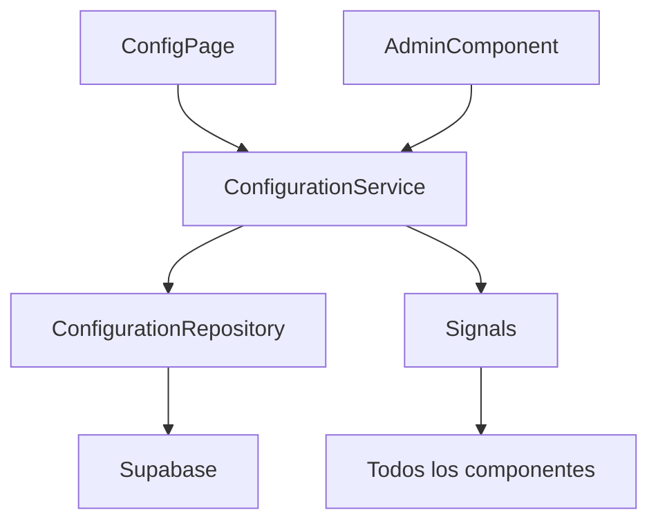

# Motor de Configuración

Versión 1.0

---

## 1. Objetivo

El Motor de Configuración es el componente más importante de la aplicación desde el punto de vista arquitectónico.

Su objetivo es permitir que **toda la aplicación sea configurable sin modificar el código fuente**.

---

## 2. Filosofía

Nunca escribir listas fijas.

Incorrecto:

```typescript
const attackTypes = ['Contraataque', 'Transición', 'Estático'];
```

Correcto:

```typescript
const attackTypes = await configService.getAttackTypes();
```

---

## 3. Responsabilidades

El motor debe:
- Cargar catálogos desde Supabase
- Mantenerlos en caché (memoria)
- Exponerlos como Signals
- Permitir CRUD sobre cualquier catálogo
- Notificar cambios a toda la aplicación
- Soportar configuración por equipo

---

## 4. Arquitectura



---

## 5. ConfigurationService

```typescript
import { Injectable, inject, signal } from '@angular/core';
import { ConfigurationRepository } from '../repositories/configuration.repository';
import type { SelectOption } from '@shared/models';

@Injectable({ providedIn: 'root' })
export class ConfigurationService {
  private readonly repo = inject(ConfigurationRepository);

  readonly attackTypes = signal<SelectOption[]>([]);
  readonly systems = signal<SelectOption[]>([]);
  readonly results = signal<SelectOption[]>([]);
  readonly initTypes = signal<SelectOption[]>([]);
  readonly tags = signal<SelectOption[]>([]);
  readonly loaded = signal(false);

  private currentTeamId: string | null = null;

  async loadCatalogs(teamId: string): Promise<void> {
    if (this.currentTeamId === teamId && this.loaded()) return;

    const [
      attackTypes,
      systems,
      results,
      initTypes,
      tags,
    ] = await Promise.all([
      this.repo.findAttackTypes(teamId),
      this.repo.findSystems(teamId),
      this.repo.findResults(teamId),
      this.repo.findInitTypes(teamId),
      this.repo.findTags(teamId),
    ]);

    this.attackTypes.set(attackTypes);
    this.systems.set(systems);
    this.results.set(results);
    this.initTypes.set(initTypes);
    this.tags.set(tags);
    this.currentTeamId = teamId;
    this.loaded.set(true);
  }

  async reloadCatalogs(teamId: string): Promise<void> {
    this.loaded.set(false);
    await this.loadCatalogs(teamId);
  }

  async createAttackType(data: Partial<SelectOption>): Promise<void> {
    if (!this.currentTeamId) return;
    const created = await this.repo.createAttackType(this.currentTeamId, data);
    this.attackTypes.update(prev => [...prev, created]);
  }

  async updateAttackType(id: string, data: Partial<SelectOption>): Promise<void> {
    await this.repo.updateAttackType(id, data);
    this.attackTypes.update(prev =>
      prev.map(item => (item.id === id ? { ...item, ...data } : item))
    );
  }

  async deleteAttackType(id: string): Promise<void> {
    await this.repo.deleteAttackType(id);
    this.attackTypes.update(prev => prev.filter(item => item.id !== id));
  }

  async createSystem(data: Partial<SelectOption>): Promise<void> {
    if (!this.currentTeamId) return;
    const created = await this.repo.createSystem(this.currentTeamId, data);
    this.systems.update(prev => [...prev, created]);
  }

  async updateSystem(id: string, data: Partial<SelectOption>): Promise<void> {
    await this.repo.updateSystem(id, data);
    this.systems.update(prev =>
      prev.map(item => (item.id === id ? { ...item, ...data } : item))
    );
  }

  async deleteSystem(id: string): Promise<void> {
    await this.repo.deleteSystem(id);
    this.systems.update(prev => prev.filter(item => item.id !== id));
  }

  async createResult(data: Partial<SelectOption> & { points: number }): Promise<void> {
    if (!this.currentTeamId) return;
    const created = await this.repo.createResult(this.currentTeamId, data);
    this.results.update(prev => [...prev, created]);
  }

  async updateResult(id: string, data: Partial<SelectOption>): Promise<void> {
    await this.repo.updateResult(id, data);
    this.results.update(prev =>
      prev.map(item => (item.id === id ? { ...item, ...data } : item))
    );
  }

  async deleteResult(id: string): Promise<void> {
    await this.repo.deleteResult(id);
    this.results.update(prev => prev.filter(item => item.id !== id));
  }
}
```

---

## 6. ConfigurationRepository

```typescript
import { Injectable } from '@angular/core';
import { supabase } from '@core/utils/supabase-client';
import type { SelectOption } from '@shared/models';

@Injectable({ providedIn: 'root' })
export class ConfigurationRepository {
  async findAttackTypes(teamId: string): Promise<SelectOption[]> {
    const { data, error } = await supabase
      .from('catalog_attack_types')
      .select('id, name, short_name, color, sort_order')
      .eq('team_id', teamId)
      .eq('active', true)
      .order('sort_order');

    if (error) throw error;
    return (data ?? []).map(item => ({
      id: item.id,
      name: item.name,
      shortName: item.short_name,
      color: item.color,
    }));
  }

  async findSystems(teamId: string): Promise<SelectOption[]> {
    const { data, error } = await supabase
      .from('catalog_systems')
      .select('id, name, short_name, color, sort_order')
      .eq('team_id', teamId)
      .eq('active', true)
      .order('sort_order');

    if (error) throw error;
    return (data ?? []).map(item => ({
      id: item.id,
      name: item.name,
      shortName: item.short_name,
      color: item.color,
    }));
  }

  async findResults(teamId: string): Promise<SelectOption[]> {
    const { data, error } = await supabase
      .from('catalog_results')
      .select('id, name, short_name, points, color, sort_order')
      .eq('team_id', teamId)
      .eq('active', true)
      .order('sort_order');

    if (error) throw error;
    return (data ?? []).map(item => ({
      id: item.id,
      name: item.name,
      shortName: item.short_name,
      color: item.color,
    }));
  }

  async findInitTypes(teamId: string): Promise<SelectOption[]> {
    const { data, error } = await supabase
      .from('catalog_init_types')
      .select('id, name, short_name, color, sort_order')
      .eq('team_id', teamId)
      .eq('active', true)
      .order('sort_order');

    if (error) throw error;
    return (data ?? []).map(item => ({
      id: item.id,
      name: item.name,
      shortName: item.short_name,
      color: item.color,
    }));
  }

  async findTags(teamId: string): Promise<SelectOption[]> {
    const { data, error } = await supabase
      .from('catalog_tags')
      .select('id, name, color')
      .eq('team_id', teamId)
      .eq('active', true)
      .order('name');

    if (error) throw error;
    return (data ?? []).map(item => ({
      id: item.id,
      name: item.name,
      color: item.color,
    }));
  }

  async createAttackType(teamId: string, data: Partial<SelectOption>): Promise<SelectOption> {
    const { data: result, error } = await supabase
      .from('catalog_attack_types')
      .insert({ team_id: teamId, name: data.name, short_name: data.shortName, color: data.color })
      .select('id, name, short_name, color')
      .single();

    if (error) throw error;
    return { id: result.id, name: result.name, shortName: result.short_name, color: result.color };
  }

  async updateAttackType(id: string, data: Partial<SelectOption>): Promise<void> {
    const { error } = await supabase
      .from('catalog_attack_types')
      .update({ name: data.name, short_name: data.shortName, color: data.color })
      .eq('id', id);

    if (error) throw error;
  }

  async deleteAttackType(id: string): Promise<void> {
    const { error } = await supabase
      .from('catalog_attack_types')
      .update({ active: false })
      .eq('id', id);

    if (error) throw error;
  }

  async createSystem(teamId: string, data: Partial<SelectOption>): Promise<SelectOption> {
    const { data: result, error } = await supabase
      .from('catalog_systems')
      .insert({ team_id: teamId, name: data.name, short_name: data.shortName, color: data.color })
      .select('id, name, short_name, color')
      .single();

    if (error) throw error;
    return { id: result.id, name: result.name, shortName: result.short_name, color: result.color };
  }

  async updateSystem(id: string, data: Partial<SelectOption>): Promise<void> {
    const { error } = await supabase
      .from('catalog_systems')
      .update({ name: data.name, short_name: data.shortName, color: data.color })
      .eq('id', id);

    if (error) throw error;
  }

  async deleteSystem(id: string): Promise<void> {
    const { error } = await supabase
      .from('catalog_systems')
      .update({ active: false })
      .eq('id', id);

    if (error) throw error;
  }

  async createResult(teamId: string, data: Partial<SelectOption> & { points: number }): Promise<SelectOption> {
    const { data: result, error } = await supabase
      .from('catalog_results')
      .insert({ team_id: teamId, name: data.name, short_name: data.shortName, color: data.color, points: data.points })
      .select('id, name, short_name, color')
      .single();

    if (error) throw error;
    return { id: result.id, name: result.name, shortName: result.short_name, color: result.color };
  }

  async updateResult(id: string, data: Partial<SelectOption>): Promise<void> {
    const { error } = await supabase
      .from('catalog_results')
      .update({ name: data.name, short_name: data.shortName, color: data.color })
      .eq('id', id);

    if (error) throw error;
  }

  async deleteResult(id: string): Promise<void> {
    const { error } = await supabase
      .from('catalog_results')
      .update({ active: false })
      .eq('id', id);

    if (error) throw error;
  }
}
```

---

## 7. Catálogos gestionados

| Catálogo | Descripción |
|----------|-------------|
| attack_types | Contraataque, Transición, Estático... |
| systems | Horns, Flex, Spain, Delay... |
| results | T2+, T2-, T3+, T3-, Pérdida... |
| init_types | Saque inicial, Rebote defensivo, Robo... |
| tags | Etiquetas libres del entrenador |

---

## 8. Interfaz de administración

Cada catálogo tendrá una página de administración que permita:

- Listar elementos
- Crear nuevo
- Editar
- Reordenar
- Activar/desactivar
- Cambiar color

Todas las páginas de administración usarán el mismo componente genérico.

---

## 9. Componente genérico de administración

```typescript
@Component({
  selector: 'app-catalog-admin',
  standalone: true,
  template: `
    <div class="catalog-admin">
      <div class="catalog-admin__header">
        <h2>{{ title }}</h2>
        <button (click)="onAdd()">Añadir</button>
      </div>
      <div class="catalog-admin__list">
        @for (item of items(); track item.id) {
          <div class="catalog-admin__item">
            <span class="catalog-admin__color" [style.background]="item.color"></span>
            <span class="catalog-admin__name">{{ item.name }}</span>
            <span class="catalog-admin__short" *ngIf="item.shortName">{{ item.shortName }}</span>
            <div class="catalog-admin__actions">
              <button (click)="onEdit(item)">Editar</button>
              <button (click)="onDelete(item)">Eliminar</button>
            </div>
          </div>
        }
      </div>
    </div>
  `,
  changeDetection: ChangeDetectionStrategy.OnPush,
})
export class CatalogAdminComponent {
  @Input() title = '';
  @Input() items = signal<SelectOption[]>([]);
  @Output() add = new EventEmitter<void>();
  @Output() edit = new EventEmitter<SelectOption>();
  @Output() delete = new EventEmitter<SelectOption>();
}
```

---

## 10. Caché

Los catálogos se cargan al iniciar la aplicación y se mantienen en memoria.

Solo se recargan cuando:
- El usuario cambia de equipo
- El usuario modifica un catálogo
- Se fuerza una recarga manual

---

## 11. Configuración por equipo

Cada equipo tiene su propia configuración.

Al cambiar de equipo:
- Se recargan todos los catálogos
- Se actualizan las Signals
- Todos los componentes reaccionan automáticamente

---

## 12. Configuración global

Además de la configuración por equipo, existe un JSONB de configuración global:

```typescript
interface TeamConfigData {
  defaultSide: 'own' | 'rival';
  defaultTimeBucket: '0-8' | '9-16' | '17-24';
  showTimer: boolean;
  autoAdvancePeriod: boolean;
  possessionSound: boolean;
  quickButtons: string[];
  defaultView: 'list' | 'cards';
  theme: 'light' | 'dark' | 'auto';
}
```

---

## 13. Beneficios

- No hay que tocar código para añadir sistemas
- Cada equipo personaliza su experiencia
- Los formularios se generan dinámicamente
- La aplicación se adapta sin desplegar
- Nuevos módulos reutilizan el mismo motor

---

## 14. Decisiones

- Todos los catálogos en Supabase
- Caché en memoria con Signals
- CRUD genérico mediante repositorio
- Interfaz de administración compartida
- Configuración aislada por equipo
- Sin ENUMs en PostgreSQL para lógica de negocio

---

## Próximo documento

[05-ui-ux-partidos.md](05-ui-ux-partidos.md)
