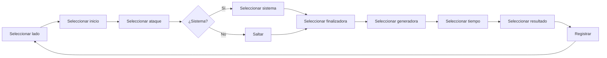

# Diseño UI/UX del Módulo de Partidos

Versión 1.0

---

## 1. Objetivo

Definir la interfaz de usuario del módulo de análisis de partidos.

El diseño debe priorizar:
- Velocidad de registro
- Claridad visual
- Adaptabilidad a dispositivos
- Mínimo número de pulsaciones

---

## 2. Principios de diseño

- Botones grandes y fáciles de pulsar
- Información clara y sin ruido visual
- Jerarquía visual mediante color y tamaño
- Feedback inmediato a cada acción
- Modo claro y oscuro
- Diseño responsive (móvil, tablet, escritorio)

---

## 3. Pantallas principales

### 3.1 Dashboard de equipo

```text
┌────────────────────────────────────────────┐
│  🏀 MI EQUIPO - Senior Femenino             │
├────────────────────────────────────────────┤
│  ┌──────────┐ ┌──────────┐ ┌──────────┐   │
│  │ PARTIDOS  │ │ JUGADORAS │ │ ESTADÍST.│   │
│  │    12     │ │    10     │ │  VER     │   │
│  └──────────┘ └──────────┘ └──────────┘   │
│                                            │
│  ÚLTIMOS PARTIDOS                           │
│  ┌────────────────────────────────────────┐│
│  │ Cáceres 72 - 65 Badajoz   📅 15/03    ││
│  │ PPP: 1.24  |  ORtg: 124  |  DRtg: 105 ││
│  ├────────────────────────────────────────┤│
│  │ Cáceres 58 - 61 Mérida    📅 08/03    ││
│  │ PPP: 1.05  |  ORtg: 105  |  DRtg: 110 ││
│  └────────────────────────────────────────┘│
│                                            │
│  [+ Nuevo Partido]                         │
└────────────────────────────────────────────┘
```

### 3.2 Nuevo partido / Editar

```text
┌────────────────────────────────────────────┐
│  ← Volver    NUEVO PARTIDO                  │
├────────────────────────────────────────────┤
│                                            │
│  Rival: [________________________]         │
│                                            │
│  Competición: [▼ Liga Regular _____]       │
│                                            │
│  Jornada: [_____]                          │
│                                            │
│  Fecha: [📅 15/03/2026]                    │
│                                            │
│  Lugar: [● Local  ○ Visitante]            │
│                                            │
│  ┌────────────────────────┐                │
│  │     CREAR PARTIDO      │                │
│  └────────────────────────┘                │
└────────────────────────────────────────────┘
```

### 3.3 Convocatoria

```text
┌────────────────────────────────────────────┐
│  ← Volver    CONVOCATORIA                   │
├────────────────────────────────────────────┤
│                                            │
│  Partido: Cáceres vs Badajoz               │
│  Fecha: 15/03/2026                         │
│                                            │
│  JUGADORAS DISPONIBLES                      │
│  ┌────────────────────────────────────────┐│
│  │ ☐  4  Marta García         Base       ││
│  │ ☐  5  Laura Sánchez       Escolta    ││
│  │ ☐  7  Ana Pérez           Alero      ││
│  │ ☐  8  Carmen López        Pívot      ││
│  │ ☐  9  Lucía Martín        Base       ││
│  │ ☐ 10  Paula Gómez         Escolta    ││
│  │ ☐ 11  Sofía Rodríguez     Alero      ││
│  │ ☐ 12  Elena Díaz          Pívot      ││
│  │ ☐ 14  Marina Torres       Base       ││
│  │ ☐ 15  Clara Ruiz          Pívot      ││
│  └────────────────────────────────────────┘│
│                                            │
│  CONVOCADAS: 10/10                         │
│                                            │
│  ┌────────────────────────┐                │
│  │   QUINTETO INICIAL     │                │
│  └────────────────────────┘                │
└────────────────────────────────────────────┘
```

### 3.4 Quinteto inicial

```text
┌────────────────────────────────────────────┐
│  ← Volver    QUINTETO INICIAL               │
├────────────────────────────────────────────┤
│                                            │
│  Arrastra las jugadoras al quinteto:        │
│                                            │
│  ┌────────────────────────────────────────┐│
│  │  BASE      │  ESCOLTA  │  ALERO       ││
│  │ ┌────────┐ │ ┌──────┐ │ ┌───────────┐ ││
│  │ │  4     │ │ │  5   │ │ │    7      │ ││
│  │ │ Marta  │ │ │Laura │ │ │  Ana      │ ││
│  │ └────────┘ │ └──────┘ │ └───────────┘ ││
│  │            │          │               ││
│  │  ALA-PÍVOT │  PÍVOT   │               ││
│  │ ┌────────┐ │ ┌──────┐ │               ││
│  │ │  8     │ │ │  12  │ │               ││
│  │ │Carmen  │ │ │Elena │ │               ││
│  │ └────────┘ │ └──────┘ │               ││
│  └────────────────────────────────────────┘│
│                                            │
│  BANQUILLO:                                 │
│  9 Lucía | 10 Paula | 11 Sofía | 14 Marina │
│  15 Clara                                   │
│                                            │
│  ┌────────────────────────┐                │
│  │    INICIAR PARTIDO     │                │
│  └────────────────────────┘                │
└────────────────────────────────────────────┘
```

---

## 4. Pantalla de registro en vivo

Esta es la pantalla más importante de toda la aplicación.

### 4.1 Layout escritorio

```text
┌───────────────────────────────────────────────────────────────┐
│  🏀 Cáceres vs Badajoz  |  Q1   |  5:30   |  Local 28-22    │
├───────────────────────┬───────────────────┬───────────────────┤
│   REGISTRO RÁPIDO      │   LÍNEA DE TIEMPO │   ESTADÍSTICAS    │
│                       │                   │                   │
│  LADO                 │  ┌───┐            │  PPP: 1.24        │
│  [● Propia ○ Rival]  │  │ ■ │ Q1-01      │  ORtg: 124        │
│                       │  │ ■ │ Q1-02      │  DRtg: 105        │
│  INICIO               │  │ ■ │ Q1-03      │                   │
│  [▼ Saque fondo  ▼]   │  │ ■ │ Q1-04      │  SISTEMAS         │
│                       │  └───┘            │  Horns 4 (1.50)   │
│  ATAQUE               │                   │  Flex  3 (1.00)   │
│  [▼ Estático ▼]       │                   │                   │
│                       │                   │  JUGADORAS         │
│  SISTEMA              │                   │  4 Marta: 8 pts   │
│  [▼ Horns ▼]          │                   │  5 Laura: 6 pts   │
│                       │                   │  7 Ana: 4 pts     │
│  FINALIZADORA         │                   │                   │
│  [4 | 5 | 7 | 8 | 12] │                   │                   │
│                       │                   │                   │
│  GENERADORA           │                   │                   │
│  [4 | 5 | 7 | -  ]   │                   │                   │
│                       │                   │                   │
│  TIEMPO               │                   │                   │
│  [0-8] [9-16] [17-24] │                   │                   │
│                       │                   │                   │
│  RESULTADO            │                   │                   │
│  ┌────┐┌────┐┌────┐  │                   │                   │
│  │ T2 ││ T3 ││ PER │  │                   │                   │
│  │  + ││  + ││     │  │                   │                   │
│  └────┘└────┘└────┘  │                   │                   │
│  ┌────┐┌────┐┌────┐  │                   │                   │
│  │ T2 ││ T3 ││ FAL │  │                   │                   │
│  │  - ││  - ││     │  │                   │                   │
│  └────┘└────┘└────┘  │                   │                   │
│                       │                   │                   │
│  ┌──────────────────┐ │                   │                   │
│  │   REGISTRAR (⏎)  │ │                   │                   │
│  └──────────────────┘ │                   │                   │
└───────────────────────┴───────────────────┴───────────────────┘
```

### 4.2 Layout tablet

```text
┌────────────────────────────────────────────┐
│  Q1  |  Cáceres 28 - 22 Badajoz    ⏱ 5:30 │
├────────────────────────────────────────────┤
│                                            │
│  LADO   [● Propia  ○ Rival]               │
│                                            │
│  INICIO [▼ Saque fondo              ▼]    │
│  ATAQUE [▼ Estático                 ▼]    │
│  SISTEMA [▼ Horns                   ▼]    │
│                                            │
│  FINALIZADORA                              │
│  [4] [5] [7] [8] [9] [10] [11] [12] [14]  │
│                                            │
│  GENERADORA                                │
│  [─] [4] [5] [7] [8] [9] [10] [11] [12]   │
│                                            │
│  TIEMPO   [0-8] [9-16] [17-24]             │
│                                            │
│  RESULTADO                                 │
│  ┌──────┐ ┌──────┐ ┌──────┐ ┌──────┐     │
│  │ T2 + │ │ T3 + │ │ PER  │ │ FAL  │     │
│  └──────┘ └──────┘ └──────┘ └──────┘     │
│  ┌──────┐ ┌──────┐ ┌──────┐               │
│  │ T2 - │ │ T3 - │ │ TL   │               │
│  └──────┘ └──────┘ └──────┘               │
│                                            │
│  ┌────────────────────────────────────┐   │
│  │          REGISTRAR (⏎)             │   │
│  └────────────────────────────────────┘   │
│                                            │
│  ─── ÚLTIMAS POSESIONES ───               │
│  Q1-05 T3+ Ana (asistencia Marta)   3 pts │
│  Q1-04 PER Laura                     0 pts │
│  Q1-03 T2+ Marta                     2 pts │
│  ─────────────────────────────────────    │
│  PPP: 1.24  |  12 posesiones              │
└────────────────────────────────────────────┘
```

### 4.3 Layout móvil

```text
┌──────────────────────────────┐
│  Q1  Cáceres 28 - 22 Badajoz │
├──────────────────────────────┤
│  [● Propia] [○ Rival]        │
│                              │
│  INICIO [▼ Saque fondo  ▼]  │
│  ATAQUE [▼ Estático    ▼]   │
│  SISTEMA [▼ Horns      ▼]   │
│                              │
│  FINALIZADORA                │
│  [4][5][7][8][9][10][11][12] │
│                              │
│  GENERADORA                  │
│  [─][4][5][7][8][9][10][11]  │
│                              │
│  TIEMPO                      │
│  [0-8] [9-16] [17-24]       │
│                              │
│  RESULTADO                   │
│  ┌────┐┌────┐┌────┐┌────┐  │
│  │T2+ ││T3+ ││PER ││FAL │  │
│  └────┘└────┘└────┘└────┘  │
│  ┌────┐┌────┐               │
│  │T2- ││T3- │               │
│  └────┘└────┘               │
│                              │
│  ┌────────────────────────┐ │
│  │     REGISTRAR (⏎)      │ │
│  └────────────────────────┘ │
└──────────────────────────────┘
```

---

## 5. Flujo de registro de posesión



**Objetivo: 3-5 segundos por posesión.**

---

## 6. Atajos de teclado

| Tecla | Acción |
|-------|--------|
| 1-5 | Finalizadora (orden en botonera) |
| 6-0 | Generadora |
| Q | Lado propio |
| W | Lado rival |
| A | Contraataque |
| S | Transición |
| D | Estático |
| Z | Horns |
| X | Flex |
| C | Spain |
| F | T2 anotado |
| G | T3 anotado |
| V | Pérdida |
| B | Falta recibida |
| R | Deshacer |
| Space | Último resultado (registro rápido) |
| Enter | Registrar |

---

## 7. Gestión de cambios

```text
┌────────────────────────────────────────────┐
│  CAMBIOS  |  Q1                           │
├────────────────────────────────────────────┤
│                                            │
│  QUINTETO ACTUAL                            │
│  ┌────────┐ ┌────────┐ ┌────────┐         │
│  │  4     │ │  7     │ │  9     │         │
│  │ Marta  │ │  Ana   │ │ Lucía  │         │
│  └────────┘ └────────┘ └────────┘         │
│  ┌────────┐ ┌────────┐                    │
│  │  10    │ │  12    │                    │
│  │ Paula  │ │ Elena  │                    │
│  └────────┘ └────────┘                    │
│                                            │
│  BANQUILLO                                 │
│  5 Laura | 8 Carmen | 11 Sofía | 14 Marina │
│  15 Clara                                  │
│                                            │
│  ┌────────────────────────────────────────┐│
│ │ ¿Quién sale? [▼] ¿Quién entra? [▼]     ││
│ │  ┌──────────────────────────┐           ││
│ │  │     REGISTRAR CAMBIO     │           ││
│ │  └──────────────────────────┘           ││
│ └────────────────────────────────────────┘│
│                                            │
│  HISTORIAL DE CAMBIOS                      │
│  Q1 - 3: Sale 5 Laura, entra 9 Lucía      │
│  Q1 - 6: Sale 8 Carmen, entra 10 Paula    │
└────────────────────────────────────────────┘
```

---

## 8. Timeline de posesiones

```text
┌────────────────────────────────────────────┐
│  POSESIONES  |  Q1                         │
├────────────────────────────────────────────┤
│                                            │
│  PROPIA           │  RIVAL                  │
│  ┌────────────────│────────────────────┐   │
│  │ ■ Q1-01 T2+   │ │ ■ Q1-02 T3+      │   │
│  │   Marta 3pts  │ │   Rival 3pts     │   │
│  ├────────────────│────────────────────┤   │
│  │ ■ Q1-03 PER   │ │ ■ Q1-04 T2-      │   │
│  │   Laura 0pts  │ │   Rival 0pts     │   │
│  ├────────────────│────────────────────┤   │
│  │ ■ Q1-05 T3+   │ │ ■ Q1-06 T2+      │   │
│  │   Ana 3pts    │ │   Rival 2pts     │   │
│  ├────────────────│────────────────────┤   │
│  │ ■ Q1-07 FAL   │ │ ■ Q1-08 PER      │   │
│  │   Marta 0pts  │ │   Rival 0pts     │   │
│  └────────────────│────────────────────┘   │
└────────────────────────────────────────────┘
```

---

## 9. Dashboard post-partido

```text
┌────────────────────────────────────────────┐
│  📊 RESUMEN DEL PARTIDO                     │
│  Cáceres 72 - 65 Badajoz                    │
├────────────────────────────────────────────┤
│                                            │
│  ┌──────┐ ┌──────┐ ┌──────┐ ┌──────┐     │
│  │ PPP  │ │ORtg  │ │DRtg  │ │RITMO  │     │
│  │1.24  │ │124   │ │105   │ │74     │     │
│  └──────┘ └──────┘ └──────┘ └──────┘     │
│                                            │
│  ── EFICIENCIA POR SISTEMA ──              │
│  Horns  4 pos  1.50 PPP  ▲▲▲▲▲▲▲░░░       │
│  Flex   3 pos  1.00 PPP  ▲▲▲▲░░░░░░       │
│  Spain  2 pos  1.50 PPP  ▲▲▲▲▲▲▲░░░       │
│  Delay  1 pos  2.00 PPP  ▲▲▲▲▲▲▲▲▲░       │
│                                            │
│  ── EFICIENCIA POR TIPO DE ATAQUE ──       │
│  Contraataque  3 pos  1.67 PPP             │
│  Transición    5 pos  1.20 PPP             │
│  Estático      6 pos  1.17 PPP             │
│  Reb ofensivo  2 pos  1.00 PPP             │
│                                            │
│  ── JUGADORA DESTACADA ──                  │
│  Marta García: 18 pts, 3 gen, 1.50 PPP     │
│                                            │
│  ┌──────────┐ ┌──────────┐ ┌──────────┐   │
│  │ VER MÁS  │ │ COMPARAR │ │ EXPORTAR │   │
│  └──────────┘ └──────────┘ └──────────┘   │
└────────────────────────────────────────────┘
```

---

## 10. Paleta de colores

```css
:root {
  --color-own: #3b82f6;
  --color-own-bg: #eff6ff;
  --color-rival: #ef4444;
  --color-rival-bg: #fef2f2;
  --color-pts-2: #10b981;
  --color-pts-3: #f59e0b;
  --color-turnover: #ef4444;
  --color-foul: #8b5cf6;
  --color-miss: #9ca3af;
  --color-system-horns: #6366f1;
  --color-system-flex: #ec4899;
  --color-system-spain: #14b8a6;
  --color-system-delay: #f97316;
}
```

---

## 11. Responsive breakpoints

| Dispositivo | Ancho | Layout |
|-------------|-------|--------|
| Móvil | < 640px | Una columna, botonera compacta |
| Tablet | 640-1024px | Dos columnas, botonera normal |
| Escritorio | > 1024px | Tres columnas, panel completo |

---

## 12. Modo oscuro

Toda la interfaz debe soportar modo oscuro.

Variables CSS para modo oscuro:

```css
[data-theme='dark'] {
  --bg-primary: #0f172a;
  --bg-secondary: #1e293b;
  --text-primary: #f1f5f9;
  --text-secondary: #94a3b8;
  --border: #334155;
}
```

---

## 13. Transiciones y feedback

- Cada posesión registrada muestra una animación breve
- Las tarjetas KPI se actualizan en tiempo real
- El timeline se desplaza automáticamente
- Los botones tienen estado activo/pulsado visible
- Sonido opcional al registrar (configurable)

---

## 14. Estados vacíos

```text
┌────────────────────────────────────────────┐
│                                            │
│        📋  No hay posesiones aún           │
│                                            │
│    Selecciona el lado y el resultado        │
│    para empezar a registrar                 │
│                                            │
│                                            │
└────────────────────────────────────────────┘
```

---

## 15. Estados de carga

```text
┌────────────────────────────────────────────┐
│  Cargando partido...                       │
│  ████████░░░░░░░░░░░░░░░░                   │
└────────────────────────────────────────────┘
```

---

## 16. Decisiones de UI

- Botonera como elemento principal
- Timeline lateral en escritorio, inferior en móvil
- KPIs siempre visibles
- Selectores con valores por defecto inteligentes
- Última acción fácilmente repetible
- Diseño mobile-first
- Sin menús jerárquicos profundos

---

## Próximo documento

[06-flujo-toma-datos.md](06-flujo-toma-datos.md)
