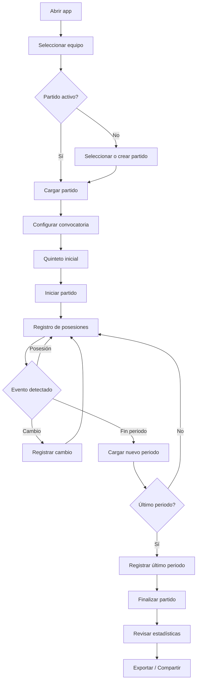
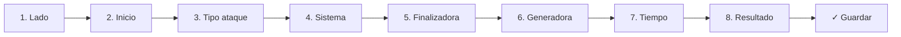
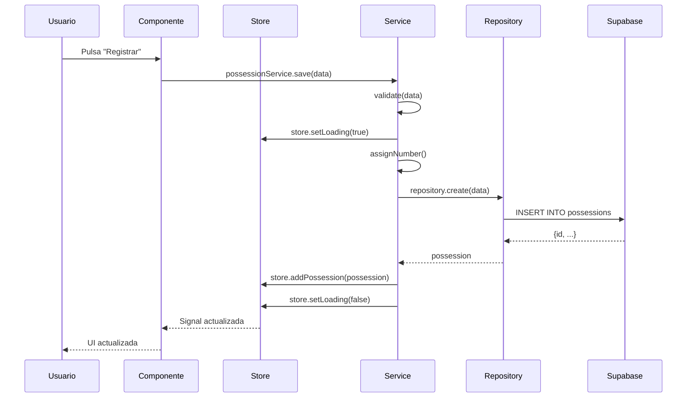
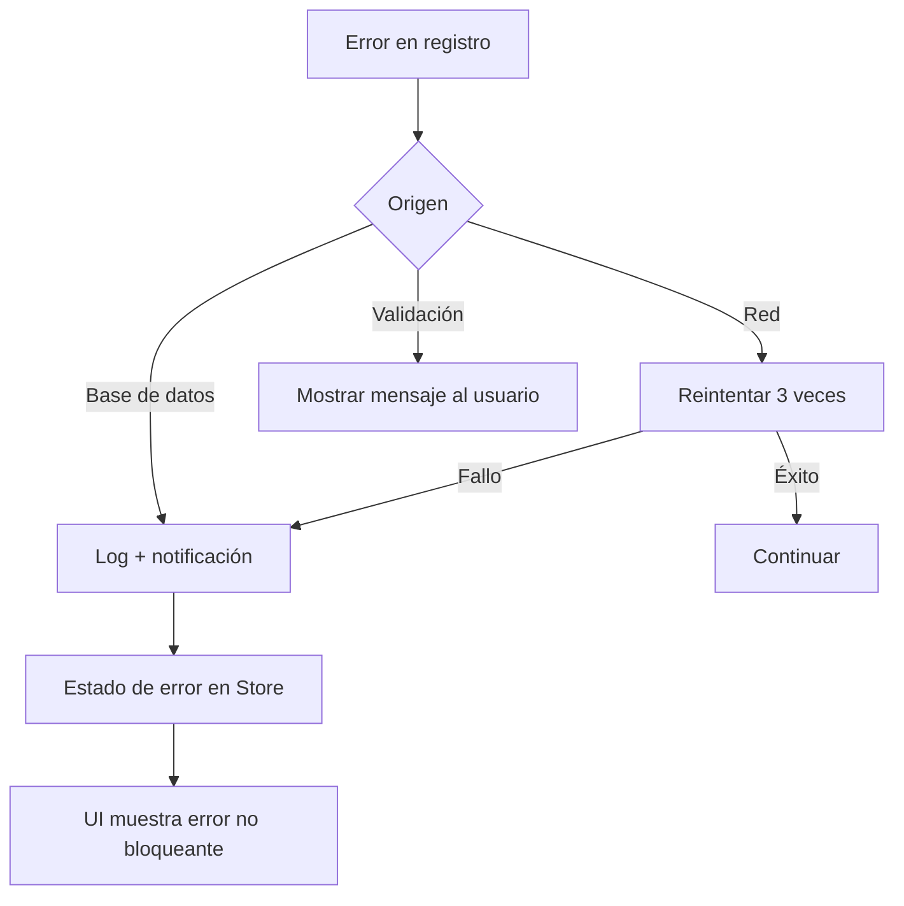
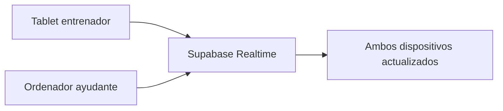

# Flujo de Toma de Datos

Versión 1.0

---

## 1. Objetivo

Este documento describe el flujo completo de la captura de datos durante un partido, desde que el entrenador abre la aplicación hasta que finaliza el registro.

---

## 2. Flujo completo



---

## 3. Preparación previa al partido

### 3.1 Configuración inicial

Antes del primer partido, el entrenador debe:

1. Crear el equipo
2. Añadir jugadoras
3. Configurar catálogos (sistemas, resultados, etc.)
4. Crear temporada
5. Añadir competiciones

### 3.2 Antes del partido

1. Seleccionar equipo y temporada
2. Crear partido (rival, competición, fecha)
3. Seleccionar convocatoria (10-12 jugadoras)
4. Elegir quinteto inicial

---

## 4. Durante el partido

### 4.1 Inicio

1. Pulsar "Iniciar partido"
2. La aplicación pasa a modo LIVE
3. El cronómetro comienza (opcional)

### 4.2 Registro de posesiones

Cada posesión se registra en una secuencia de pasos.



**Paso 1: Lado**
- Por defecto: propio (alterna automáticamente)
- Se puede cambiar manualmente

**Paso 2: Tipo de inicio**
- Saque inicial
- Saque de fondo
- Rebote defensivo
- Rebote ofensivo
- Robo
- Tiro libre

**Paso 3: Tipo de ataque**
- Contraataque
- Transición
- Estático
- Saque
- Rebote ofensivo

**Paso 4: Sistema** (opcional)
- Horns, Flex, Spain, Delay...
- Se puede omitir si no aplica

**Paso 5: Finalizadora**
- Seleccionar jugadora del quinteto activo
- Botones grandes con número y nombre

**Paso 6: Generadora** (opcional)
- Jugadora que crea la ventaja
- Puede omitirse

**Paso 7: Rango temporal**
- 0-8 segundos
- 9-16 segundos
- 17-24 segundos

**Paso 8: Resultado**
- Botones de acción directa
- T2 anotado | T2 fallado
- T3 anotado | T3 fallado
- Pérdida
- Falta recibida
- Final de periodo

### 4.3 Registro rápido

Si el usuario repite una posesión similar, puede usar:

- **Repetir última**: Carga los mismos valores de la posesión anterior
- **Atajo de teclado**: Enter para registrar con los valores actuales

### 4.4 Gestión de cambios

Durante el partido, cuando se produce una sustitución:

1. Pulsar "Cambio"
2. Seleccionar jugadora que sale
3. Seleccionar jugadora que entra
4. Confirmar

El quinteto activo se actualiza automáticamente.

### 4.5 Cambio de periodo

1. La aplicación detecta el fin de periodo (o el usuario lo indica manualmente)
2. Incrementa el contador de periodo
3. Reinicia el quinteto con las jugadoras en pista al inicio del nuevo periodo

---

## 5. Flujo de datos en la aplicación



---

## 6. Validaciones

### 6.1 Del lado del servicio

```typescript
validatePossession(data: PossessionFormData): string | null {
  if (!data.side) return 'Selecciona el lado';
  if (!data.attackTypeId) return 'Selecciona el tipo de ataque';
  if (!data.resultId) return 'Selecciona el resultado';
  if (!data.timeBucket) return 'Selecciona el rango temporal';
  if (data.points < 0 || data.points > 4) return 'Puntos inválidos';
  return null;
}
```

### 6.2 Del lado de la base de datos

```sql
CREATE OR REPLACE FUNCTION validate_possession()
RETURNS TRIGGER AS $$
BEGIN
  IF NEW.side NOT IN ('own', 'rival') THEN
    RAISE EXCEPTION 'Side must be own or rival';
  END IF;
  IF NEW.period < 1 THEN
    RAISE EXCEPTION 'Period must be >= 1';
  END IF;
  IF NEW.points NOT IN (0, 1, 2, 3, 4) THEN
    RAISE EXCEPTION 'Points must be 0, 1, 2, 3 or 4';
  END IF;
  IF NEW.time_bucket NOT IN ('0-8', '9-16', '17-24') THEN
    RAISE EXCEPTION 'Invalid time bucket';
  END IF;
  RETURN NEW;
END;
$$ LANGUAGE plpgsql;

CREATE TRIGGER validate_possession_trigger
  BEFORE INSERT OR UPDATE ON possessions
  FOR EACH ROW EXECUTE FUNCTION validate_possession();
```

---

## 7. Números de posesión

El número de posesión se asigna automáticamente:

```typescript
async getNextPossessionNumber(matchId: string): Promise<number> {
  const lastPossession = await this.possessionRepo
    .findLastByMatch(matchId);

  return (lastPossession?.number ?? 0) + 1;
}
```

---

## 8. Reconstrucción del quinteto

```typescript
function getActiveLineup(
  starters: string[],
  substitutions: Substitution[],
  period: number,
  possessionNumber: number
): string[] {
  const onCourt = [...starters];

  const relevantSubs = substitutions.filter(
    s => s.period < period ||
        (s.period === period && s.orderInPeriod <= possessionNumber)
  );

  for (const sub of relevantSubs) {
    const outIndex = onCourt.indexOf(sub.playerOut);
    if (outIndex !== -1) {
      onCourt[outIndex] = sub.playerIn;
    }
  }

  return onCourt;
}
```

---

## 9. Manejo de errores



---

## 10. Modos de captura

### 10.1 Captura en directo

- El usuario registra mientras ve el partido
- Prioridad máxima: velocidad
- Atajos de teclado esenciales
- Sin pausas

### 10.2 Captura mediante vídeo

- El usuario reproduce el partido y registra
- Puede pausar, retroceder, avanzar
- Menos presión de tiempo
- Mayor precisión

### 10.3 Captura diferida

- El usuario registra posesiones después del partido
- Puede tomarse el tiempo necesario
- Acceso a repeticiones

---

## 11. Sincronización multidispositivo



**Casos de uso:**
- Entrenador registra en tablet, ayudante ve estadísticas en ordenador
- Dos entrenadores registran distinto lado (own/rival)
- Ayudante gestiona cambios mientras entrenador registra posesiones

---

## 12. Post-partido

### 12.1 Revisión

1. Finalizar partido
2. Revisar posesiones registradas
3. Editar posesiones incorrectas
4. Añadir notas
5. Ver estadísticas

### 12.2 Edición de posesiones

- El usuario puede modificar cualquier posesión
- Las modificaciones quedan registradas en auditoría
- El quinteto se recalcula automáticamente

### 12.3 Exportación

- CSV con todas las posesiones
- PDF con estadísticas
- Resumen ejecutivo
- Informe detallado

---

## 13. Estados de la UI durante la captura

| Estado | UI |
|--------|----|
| Cargando | Spinner + "Cargando partido..." |
| Preparado | Botonera activa, timer parado |
| En curso | Botonera activa, timer corriendo |
| Registrando | Feedback visual animación OK |
| Error | Toast no bloqueante + datos seguros |
| Pausa | Botonera desactivada parcialmente |
| Fin periodo | Confirmación cambio de periodo |

---

## 14. Persistencia de datos

Los datos nunca se pierden aunque ocurra un error:

1. Cada posesión se guarda individualmente en Supabase
2. Si falla una, las anteriores ya están guardadas
3. No existe "transacción de partido completo"
4. El entrenador puede retomar donde lo dejó

---

## 15. Flujo de deshacer

```text
Registrar posesión → Aparece botón "Deshacer" (5 segundos)
→ Si pulsa "Deshacer": elimina la última posesión
→ Si no pulsa: el botón desaparece
→ También accesible desde el timeline
```

---

## 16. Timing

Objetivos de rendimiento:

| Operación | Tiempo objetivo |
|-----------|-----------------|
| Registrar posesión | < 5 segundos |
| Deshacer | < 1 segundo |
| Cambiar periodo | < 2 segundos |
| Cambiar de jugador | < 3 segundos |
| Sincronizar | < 1 segundo |
| Cargar partido | < 2 segundos |

---

## Próximo documento

[07-estadisticas.md](07-estadisticas.md)
