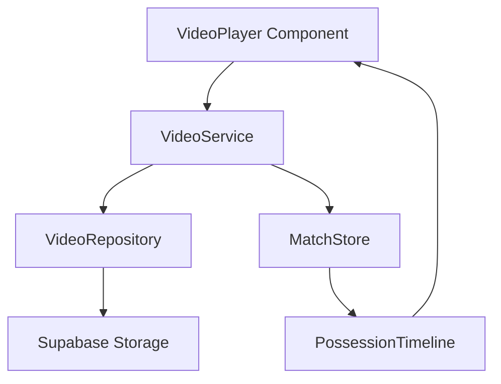
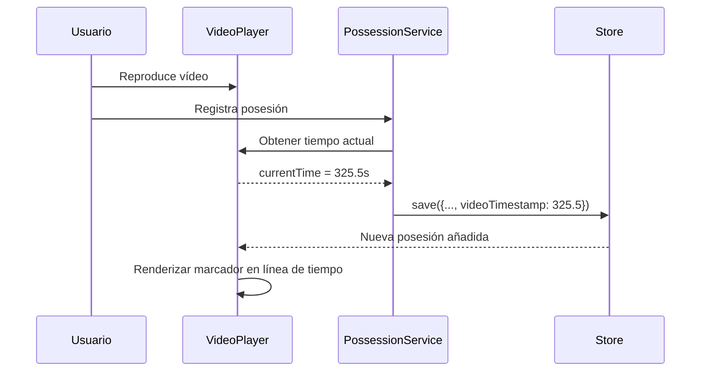

# Motor de Vídeo

Versión 1.0

---

## 1. Objetivo

Definir el sistema de integración de vídeo en la aplicación para sincronizar posesiones registradas con clips de vídeo del partido.

---

## 2. Funcionalidades principales

El motor de vídeo permitirá:
- Reproducir vídeo del partido dentro de la aplicación
- Asociar cada posesión a un instante de tiempo del vídeo
- Navegar entre posesiones saltando al instante correspondiente
- Generar clips automáticos por posesión
- Sincronizar la reproducción con el registro en directo
- Exportar clips para análisis o scouting

---

## 3. Arquitectura



---

## 4. VideoService

```typescript
@Injectable({ providedIn: 'root' })
export class VideoService {
  private readonly repo = inject(VideoRepository);
  private readonly store = inject(MatchStore);

  private currentTime = signal(0);
  private isPlaying = signal(false);
  private duration = signal(0);

  readonly currentTime$ = this.currentTime.asReadonly();
  readonly isPlaying$ = this.isPlaying.asReadonly();
  readonly duration$ = this.duration.asReadonly();

  async loadVideo(matchId: string): Promise<string | null> {
    return this.repo.getVideoUrl(matchId);
  }

  seekToPossession(possession: Possession): void {
    if (possession.videoTimestamp != null) {
      this.currentTime.set(possession.videoTimestamp);
    }
  }

  getPossessionClip(possession: Possession): { start: number; end: number } {
    const start = possession.videoTimestamp ?? 0;
    const end = start + 15; // 15 segundos por defecto
    return { start, end };
  }
}
```

---

## 5. VideoRepository

```typescript
@Injectable({ providedIn: 'root' })
export class VideoRepository {
  private readonly bucket = 'match-videos';

  async getVideoUrl(matchId: string): Promise<string | null> {
    const { data } = supabase
      .storage
      .from(this.bucket)
      .getPublicUrl(`${matchId}/full.mp4`);

    return data?.publicUrl ?? null;
  }

  async uploadVideo(matchId: string, file: File): Promise<string> {
    const { data, error } = await supabase
      .storage
      .from(this.bucket)
      .upload(`${matchId}/full.mp4`, file);

    if (error) throw error;
    return data.path;
  }

  async deleteVideo(matchId: string): Promise<void> {
    await supabase
      .storage
      .from(this.bucket)
      .remove([`${matchId}/full.mp4`]);
  }
}
```

---

## 6. Modelo de datos

Extensión de la tabla `possessions` para soportar vídeo:

```sql
ALTER TABLE possessions ADD COLUMN IF NOT EXISTS video_timestamp NUMERIC(10, 3);
ALTER TABLE possessions ADD COLUMN IF NOT EXISTS video_clip_url TEXT;
CREATE INDEX idx_possessions_video ON possessions(video_timestamp)
  WHERE video_timestamp IS NOT NULL;
```

---

## 7. Componente VideoPlayer

```typescript
@Component({
  selector: 'app-video-player',
  standalone: true,
  template: `
    <div class="video-player">
      <video
        #videoPlayer
        [src]="videoUrl()"
        (timeupdate)="onTimeUpdate($event)"
        (loadedmetadata)="onLoaded($event)"
      ></video>
      <div class="video-controls">
        <button (click)="togglePlay()">
          {{ isPlaying() ? '⏸' : '▶' }}
        </button>
        <input
          type="range"
          [value]="currentTime()"
          [max]="duration()"
          (input)="onSeek($event)"
        />
        <span>{{ formatTime(currentTime()) }}</span>
        <button (click)="goToPreviousPossession()">⏮</button>
        <button (click)="goToNextPossession()">⏭</button>
      </div>
      <div class="possession-markers">
        @for (possession of possessions(); track possession.id) {
          <div
            class="marker"
            [style.left.%]="getMarkerPosition(possession)"
            [class.own]="possession.side === 'own'"
            [class.rival]="possession.side === 'rival'"
            (click)="seekToPossession(possession)"
            [title]="getMarkerTitle(possession)"
          ></div>
        }
      </div>
    </div>
  `,
  changeDetection: ChangeDetectionStrategy.OnPush,
})
export class VideoPlayerComponent {
  @Input() videoUrl!: Signal<string | null>;
  @Input() possessions!: Signal<Possession[]>;
  @Output() possessionSelected = new EventEmitter<Possession>();

  readonly currentTime = signal(0);
  readonly isPlaying = signal(false);
  readonly duration = signal(0);

  private videoEl!: HTMLVideoElement;

  @ViewChild('videoPlayer') set videoRef(el: ElementRef<HTMLVideoElement>) {
    if (el) this.videoEl = el.nativeElement;
  }

  togglePlay(): void {
    if (!this.videoEl) return;
    if (this.videoEl.paused) {
      this.videoEl.play();
      this.isPlaying.set(true);
    } else {
      this.videoEl.pause();
      this.isPlaying.set(false);
    }
  }

  onTimeUpdate(event: Event): void {
    const video = event.target as HTMLVideoElement;
    this.currentTime.set(video.currentTime);
  }

  onLoaded(event: Event): void {
    const video = event.target as HTMLVideoElement;
    this.duration.set(video.duration);
  }

  onSeek(event: Event): void {
    const value = +(event.target as HTMLInputElement).value;
    if (this.videoEl) {
      this.videoEl.currentTime = value;
    }
    this.currentTime.set(value);
  }

  seekToPossession(possession: Possession): void {
    if (this.videoEl && possession.videoTimestamp != null) {
      this.videoEl.currentTime = possession.videoTimestamp;
      this.currentTime.set(possession.videoTimestamp);
      this.possessionSelected.emit(possession);
    }
  }

  goToPreviousPossession(): void {
    const sorted = [...this.possessions()]
      .filter(p => p.videoTimestamp != null)
      .sort((a, b) => (a.videoTimestamp ?? 0) - (b.videoTimestamp ?? 0));

    const current = this.currentTime();
    const prev = sorted.reverse().find(p => (p.videoTimestamp ?? 0) < current - 1);
    if (prev) this.seekToPossession(prev);
  }

  goToNextPossession(): void {
    const sorted = [...this.possessions()]
      .filter(p => p.videoTimestamp != null)
      .sort((a, b) => (a.videoTimestamp ?? 0) - (b.videoTimestamp ?? 0));

    const current = this.currentTime();
    const next = sorted.find(p => (p.videoTimestamp ?? 0) > current + 1);
    if (next) this.seekToPossession(next);
  }

  getMarkerPosition(possession: Possession): number {
    const duration = this.duration();
    if (duration === 0) return 0;
    return ((possession.videoTimestamp ?? 0) / duration) * 100;
  }

  getMarkerTitle(possession: Possession): string {
    const side = possession.side === 'own' ? 'Propia' : 'Rival';
    return `P${possession.period}-${possession.number}: ${side} - ${possession.points} pts`;
  }

  formatTime(seconds: number): string {
    const m = Math.floor(seconds / 60);
    const s = Math.floor(seconds % 60);
    return `${m}:${s.toString().padStart(2, '0')}`;
  }
}
```

---

## 8. Layout con vídeo

Pantalla de análisis con vídeo sincronizado:

```text
┌───────────────────────────────────────────────────────────────┐
│  🏀 Cáceres vs Badajoz  |  ANÁLISIS CON VÍDEO                 │
├──────────────────────────┬────────────────────────────────────┤
│                          │                                     │
│  ┌────────────────────┐  │  REGISTRO RÁPIDO                    │
│  │                    │  │                                     │
│  │    VÍDEO           │  │  [● Propia] [○ Rival]              │
│  │                    │  │  [▼ Estático ▼] [▼ Horns ▼]        │
│  │  ▶ 00:05:23 ───●──│  │  [4] [5] [7] [8] [12]             │
│  │                    │  │  [─] [4] [5] [7] [8]              │
│  │  ◀⏮ ⏸ ⏭ ▶  1x  │  │  [0-8] [9-16] [17-24]              │
│  │                    │  │  [T2+] [T3+] [PER] [FAL]          │
│  └────────────────────┘  │  ┌──────────────────────┐         │
│                          │  │     REGISTRAR         │         │
│  Marcas de posesión:     │  └──────────────────────┘         │
│  ● ● ● ● ● ● ● ● ●     │                                     │
│                          ├────────────────────────────────────┤
│                          │  POSESIÓN ACTUAL                    │
│                          │  Q1-05  T3+ Marta  3pts   00:05:23 │
│                          │                                     │
│                          │  PPP: 1.24  |  12 posesiones       │
└──────────────────────────┴────────────────────────────────────┘
```

---

## 9. Flujo de sincronización



---

## 10. Marcadores en la línea de tiempo

El componente VideoPlayer muestra marcadores en la barra de progreso:

- **Color azul**: posesiones propias
- **Color rojo**: posesiones del rival
- **Tamaño**: relacionado con puntos (opcional)
- **Tooltip**: información de la posesión
- **Click**: saltar al instante

---

## 11. Generación de clips

La aplicación permitirá generar clips automáticos:

```typescript
async function generateClip(possession: Possession): Promise<string> {
  const startTime = (possession.videoTimestamp ?? 0) - 3; // 3s antes
  const endTime = startTime + 15; // 15s totales

  // Llamar a servicio externo de recorte de vídeo
  const clipUrl = await videoEditingService.cutClip(
    matchId,
    startTime,
    endTime
  );

  // Guardar URL del clip
  await possessionRepository.update(possession.id, {
    videoClipUrl: clipUrl,
  });

  return clipUrl;
}
```

---

## 12. Posibles integraciones

- **FFmpeg**: Procesamiento serverless en Edge Functions
- **Vidyo.ai**: Servicio externo de recorte
- **Supabase Storage**: Almacenamiento de vídeos
- **HLS Streaming**: Para vídeos largos
- **WebVTT**: Subtítulos y marcadores

---

## 13. Requisitos técnicos

- Formato de vídeo: MP4 H.264
- Resolución máxima: 1080p
- Streaming adaptativo para vídeos > 5 min
- Almacenamiento: Supabase Storage (hasta 5GB por proyecto)
- Tiempo de carga inicial: < 5 segundos para vídeos de partido completo

---

## 14. Estados del motor de vídeo

| Estado | Descripción |
|--------|-------------|
| Sin vídeo | No hay vídeo asociado al partido |
| Cargando | El vídeo se está descargando |
| Listo | Vídeo listo para reproducir |
| Reproduciendo | El vídeo se está reproduciendo |
| Pausado | Vídeo en pausa |
| Error | No se puede cargar el vídeo |

---

## 15. Decisiones de diseño

- El vídeo no es obligatorio para el MVP
- Los marcadores se renderizan en el lado del cliente
- Los timestamps se almacenan en segundos con milisegundos
- La UI de vídeo se puede ocultar si no hay vídeo asociado
- La sincronización es manual (el usuario indica cuándo ocurre cada posesión)

---

## Próximo documento

[12-modulo-scouting.md](12-modulo-scouting.md)
