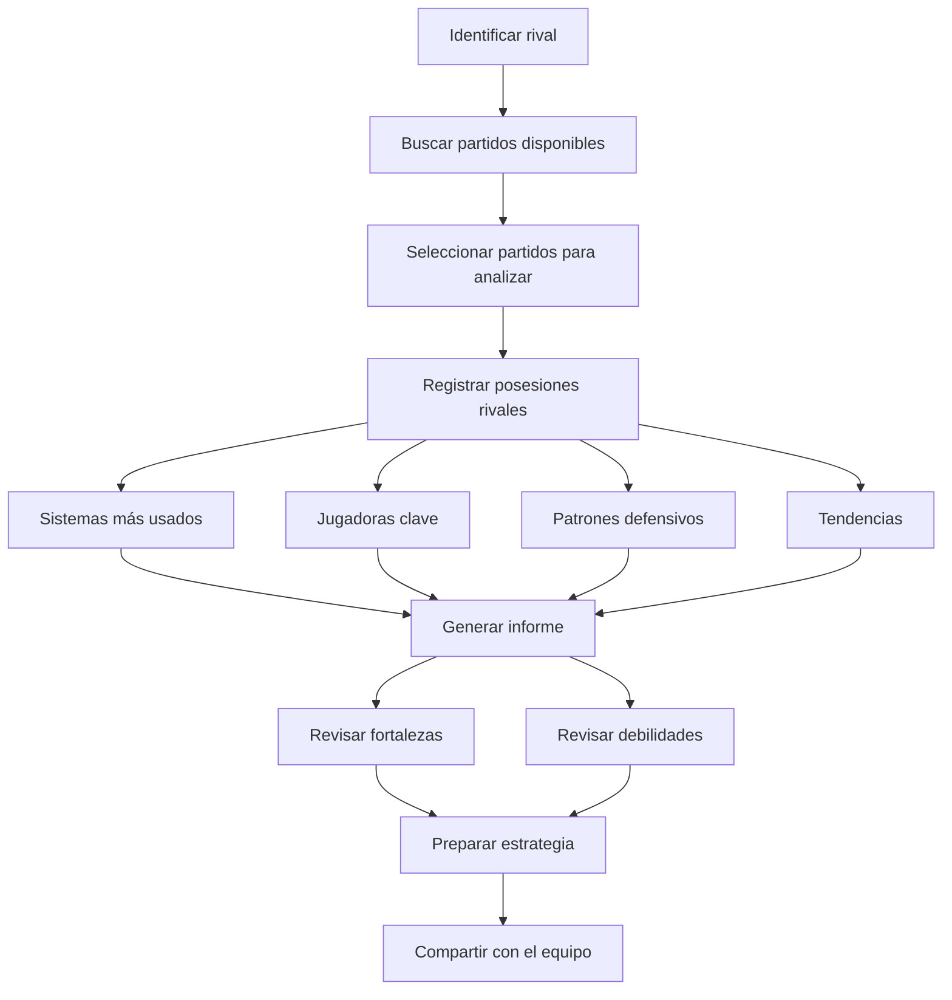
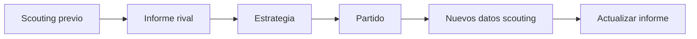

# Módulo de Scouting

Versión 1.0

---

## 1. Objetivo

El módulo de Scouting permite a los entrenadores analizar a los rivales y preparar scouting reports para los partidos.

Comparte la misma arquitectura y motor de captura que el módulo de partidos.

---

## 2. Filosofía

No reinventar el sistema de captura.

El scouting utiliza el mismo motor de posesiones pero orientado al rival:

- Las posesiones se registran desde la perspectiva del rival
- Los catálogos incluyen etiquetas específicas de scouting
- Los informes se centran en tendencias y patrones rivales

---

## 3. Funcionalidades principales

- Registrar partidos del rival
- Analizar sistemas ofensivos del rival
- Analizar defensas del rival
- Identificar jugadoras clave
- Detectar tendencias
- Generar scouting reports
- Comparar rivales
- Preparar estrategias

---

## 4. Estructura del módulo

```
features/
  scouting/
    pages/
      scouting-dashboard.page.ts
      scouting-match.page.ts
      scouting-report.page.ts
      scouting-comparison.page.ts
    
    components/
      opponent-card/
      scouting-report-card/
      tendency-chart/
      player-scouting-card/
    
    services/
      scouting.service.ts
      scouting-report.service.ts
    
    repositories/
      scouting.repository.ts
    
    store/
      scouting.store.ts
    
    models/
      scouting.model.ts
```

---

## 5. ScoutingService

```typescript
@Injectable({ providedIn: 'root' })
export class ScoutingService {
  private readonly matchService = inject(MatchService);
  private readonly statisticsService = inject(StatisticsService);
  private readonly store = inject(ScoutingStore);

  async analyzeOpponent(opponentName: string, seasonId: string): Promise<void> {
    const matches = await this.matchService.findByOpponent(opponentName, seasonId);
    this.store.setMatches(matches);

    for (const match of matches) {
      const stats = await this.statisticsService.getTeamStats(match.id, 'rival');
      this.store.addStats(match.id, stats);
    }
  }

  getFrequentSystems(): Signal<SystemFrequency[]> {
    return computed(() => {
      const stats = this.store.allStats();
      const systemUsage = new Map<string, number>();

      for (const entry of stats) {
        for (const sys of entry.systems) {
          systemUsage.set(sys.name, (systemUsage.get(sys.name) ?? 0) + sys.count);
        }
      }

      return Array.from(systemUsage.entries())
        .map(([name, count]) => ({ name, count }))
        .sort((a, b) => b.count - a.count);
    });
  }

  getKeyPlayers(): Signal<PlayerScoutingReport[]> {
    return computed(() => {
      const stats = this.store.allStats();
      const playerStats = new Map<string, PlayerScoutingReport>();

      for (const entry of stats) {
        for (const player of entry.players) {
          const existing = playerStats.get(player.id) ?? {
            ...player,
            matchesAnalyzed: 0,
            totalPossessions: 0,
            totalPoints: 0,
          };

          existing.matchesAnalyzed++;
          existing.totalPossessions += player.possessions;
          existing.totalPoints += player.points;

          playerStats.set(player.id, existing);
        }
      }

      return Array.from(playerStats.values())
        .map(p => ({
          ...p,
          ppp: +(p.totalPoints / p.totalPossessions).toFixed(2),
        }))
        .sort((a, b) => b.ppp - a.ppp);
    });
  }

  generateReport(opponentId: string): Promise<ScoutingReport> {
    return this.scoutingReportService.generate(opponentId);
  }
}
```

---

## 6. ScoutingReport

```typescript
export interface ScoutingReport {
  opponent: string;
  matchesAnalyzed: number;
  dateRange: {
    start: string;
    end: string;
  };
  overview: {
    totalPossessions: number;
    ppp: number;
    preferredAttackTypes: string[];
    preferredSystems: string[];
  };
  systems: SystemFrequency[];
  attackTypes: AttackTypeFrequency[];
  keyPlayers: PlayerScoutingReport[];
  defensePatterns: DefensePattern[];
  tendencies: Tendency[];
  strengths: string[];
  weaknesses: string[];
  recommendations: string[];
}

export interface SystemFrequency {
  name: string;
  count: number;
  percentage: number;
  ppp: number;
}

export interface PlayerScoutingReport {
  id: string;
  name: string;
  number: number;
  position: string;
  matchesAnalyzed: number;
  totalPossessions: number;
  totalPoints: number;
  ppp: number;
  preferredSystems: string[];
  effectivenessBySystem: Record<string, number>;
}

export interface DefensePattern {
  type: string;
  frequency: number;
  effectiveness: number;
}

export interface Tendency {
  description: string;
  percentage: number;
  situations: string;
}
```

---

## 7. Flujo de trabajo de scouting



---

## 8. Scouting desde la captura de partido

Durante el registro de un partido propio, el entrenador puede marcar posesiones para scouting:

```text
Q1-05: T3+ rival (Jugadora 7) → Marcar para scouting
  → Etiqueta: "Sistema preferido en clutch"
  → Nota: "Siempre busca el bloqueo directo en situaciones de ventaja mínima"
```

---

## 9. Dashboard de scouting

```text
┌────────────────────────────────────────────┐
│  🔍 SCOUTING - CÁCERES                     │
├────────────────────────────────────────────┤
│                                            │
│  RIVAL: Badajoz                            │
│  Partidos analizados: 5                    │
│  Último análisis: 15/03/2026               │
│                                            │
│  ── SISTEMAS MÁS USADOS ──                │
│  Horns      45%  PPP 1.20  ██████████      │
│  Flex       20%  PPP 1.05  ████░░░░░░      │
│  Spain      15%  PPP 1.35  ███░░░░░░░      │
│  Delay      10%  PPP 0.90  ██░░░░░░░░      │
│                                            │
│  ── JUGADORA CLAVE ──                      │
│  #7 Ana Pérez (Escolta)                    │
│  25 posesiones | 1.48 PPP                  │
│  Finaliza el 60% en Horns                  │
│                                            │
│  ── DEBILIDADES DETECTADAS ──             │
│  ● Pierden balón contra presión (22%)      │
│  ● PPP bajo en último cuarto (0.85)        │
│  ● Sin recursos ante zona 2-3              │
│                                            │
│  ┌──────────┐ ┌──────────┐                │
│  │  VER MÁS │ │ EXPORTAR │                │
│  └──────────┘ └──────────┘                │
└────────────────────────────────────────────┘
```

---

## 10. Comparativa de rivales

```text
┌────────────────────────────────────────────┐
│  ⚔ COMPARATIVA DE RIVALES                  │
├────────────────────────────────────────────┤
│                                            │
│  MÉTRICA        │ BADAJOZ │ MÉRIDA │ PLA   │
│  ─────────────────────────────────────────  │
│  PPP            │   1.24  │  1.05  │ 1.30  │
│  Uso Horns     │    45%  │   30%  │  50%  │
│  Pérdidas/pos  │    18%  │   22%  │  15%  │
│  Jugadora clave│  #7 Ana │ #10 Sof│ #4 Mar│
│  Debilidad     │ Presión │ T3     │ Ritmo │
└────────────────────────────────────────────┘
```

---

## 11. Preparación de partido

El módulo de scouting se integra con la preparación del partido:



---

## 12. Categorías de scouting

### Análisis ofensivo rival

- Sistemas preferidos
- Tipos de ataque
- Jugadoras finalizadoras
- Jugadoras generadoras
- Eficiencia por situación
- Rangos temporales

### Análisis defensivo rival

- Tipos de defensa
- Emparejamientos
- Intensidad
- Ajustes por periodo
- Situaciones especiales

### Situaciones específicas

- Saques de fondo
- Últimos 2 minutos
- Ventaja/desventaja
- Tras tiempo muerto
- Contra presión

---

## 13. Exportación de scouting

Los informes de scouting se pueden exportar en:
- PDF (formato impreso para el equipo)
- PowerPoint (para presentación)
- PDF resumen (una página)
- Datos CSV (para análisis externo)

---

## 14. Compartición

Los scouts pueden compartir informes con:
- El entrenador principal
- El cuerpo técnico
- Las jugadoras (versión resumida)
- Otros entrenadores del club

---

## Próximo documento

[13-dashboard.md](13-dashboard.md)
