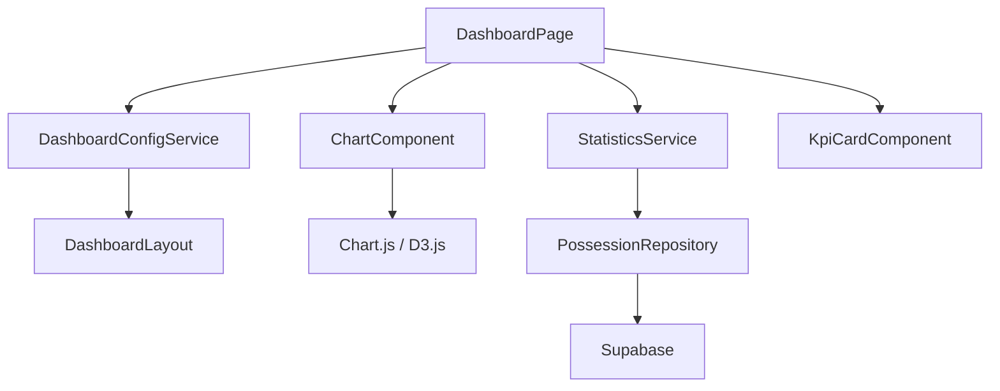

# Sistema de Dashboards

Versión 1.0

---

## 1. Objetivo

Definir el sistema de dashboards de la aplicación, que permite visualizar estadísticas y métricas de forma gráfica y personalizable.

---

## 2. Filosofía

Cada dashboard responde a una pregunta diferente:
- **Dashboard Partido**: ¿Qué pasó hoy?
- **Dashboard Temporada**: ¿Cómo vamos?
- **Dashboard Jugadora**: ¿Quién rinde?
- **Dashboard Scouting**: ¿Qué hace el rival?

Todos los dashboards comparten el mismo motor de estadísticas y el mismo sistema de filtros.

---

## 3. Arquitectura



---

## 4. DashboardService

```typescript
@Injectable({ providedIn: 'root' })
export class DashboardService {
  private readonly statsService = inject(StatisticsService);
  private readonly configService = inject(ConfigurationService);
  private readonly store = inject(DashboardStore);

  readonly kpis = signal<KpiDefinition[]>([]);
  readonly charts = signal<ChartDefinition[]>([]);
  readonly filters = signal<DashboardFilter[]>([]);

  async loadDashboard(matchId: string): Promise<void> {
    this.store.setLoading(true);

    const matchStats = await this.statsService.getMatchStats(matchId);
    const systemStats = await this.statsService.getSystemStats(matchId);
    const playerStats = await this.statsService.getPlayerStats(matchId);

    this.store.setMatchStats(matchStats);
    this.store.setSystemStats(systemStats);
    this.store.setPlayerStats(playerStats);
    this.store.setLoading(false);
  }

  async loadSeasonDashboard(seasonId: string): Promise<void> {
    this.store.setLoading(true);

    const seasonStats = await this.statsService.getSeasonStats(seasonId);
    const trends = await this.statsService.getSeasonTrends(seasonId);

    this.store.setSeasonStats(seasonStats);
    this.store.setTrends(trends);
    this.store.setLoading(false);
  }

  applyFilters(filters: DashboardFilter[]): void {
    this.store.setFilters(filters);
    this.store.setFilteredStats(this.applyFilterLogic(filters));
  }

  private applyFilterLogic(filters: DashboardFilter[]): MatchStats {
    let stats = this.store.rawStats();
    for (const filter of filters) {
      stats = this.filterStats(stats, filter);
    }
    return stats;
  }
}
```

---

## 5. Dashboard Partido

```text
┌─────────────────────────────────────────────────────┐
│  📊 CÁCERES 72 - 65 BADAJOZ  |  15/03/2026          │
├─────────────────────────────────────────────────────┤
│                                                       │
│  ┌────────┐ ┌────────┐ ┌────────┐ ┌────────┐        │
│  │ PPP    │ │ ORtg   │ │ DRtg   │ │ +/-    │        │
│  │ 1.24   │ │ 124    │ │ 105    │ │ +7     │        │
│  │ ▲ 0.05 │ │ ▲ 5    │ │ ▼ 3    │ │        │        │
│  └────────┘ └────────┘ └────────┘ └────────┘        │
│                                                       │
│  ┌─────────────────┐  ┌─────────────────┐           │
│  │ SISTEMAS         │  │ TIPOS DE ATAQUE │           │
│  │ ████ Horns 1.50  │  │ ████ Contrat.   │           │
│  │ ██ Flex   1.00   │  │ ████ Trans.     │           │
│  │ ██ Spain  1.50   │  │ █████ Estát.    │           │
│  │ █ Delay  2.00    │  │ ██ Reb.of.      │           │
│  └─────────────────┘  └─────────────────┘           │
│                                                       │
│  ┌──────────────────────────────────────┐            │
│  │ EVOLUCIÓN DEL PPP POR PERIODO         │            │
│  │ 1.50 ┤        ╱╲                      │            │
│  │ 1.25 ┤  ╱╲  ╱  ╲  ╱╲                │            │
│  │ 1.00 ┤ ╱  ╲╱    ╲╱  ╲              │            │
│  │      └──────────────────             │            │
│  │        Q1   Q2   Q3   Q4             │            │
│  └──────────────────────────────────────┘            │
│                                                       │
│  ┌──────────┐ ┌──────────┐ ┌──────────┐             │
│  │ EDITAR   │ │ COMPARAR │ │ EXPORTAR │             │
│  └──────────┘ └──────────┘ └──────────┘             │
└─────────────────────────────────────────────────────┘
```

---

## 6. Dashboard Temporada

```text
┌─────────────────────────────────────────────────────┐
│  📊 TEMPORADA 2025/26 - SENIOR FEMENINO              │
├─────────────────────────────────────────────────────┤
│                                                       │
│  ┌────────┐ ┌────────┐ ┌────────┐ ┌────────┐        │
│  │ PART.  │ │ VIC.   │ │ DER.   │ │ PPP    │        │
│  │ 12     │ │ 8      │ │ 4      │ │ 1.18   │        │
│  └────────┘ └────────┘ └────────┘ └────────┘        │
│                                                       │
│  ┌──────────────────────────────────────────┐        │
│  │ EVOLUCIÓN DEL PPP (ÚLTIMOS 12 PARTIDOS)  │        │
│  │ 1.50 ┤   ╱╲    ╱╲    ╱╲                  │        │
│  │ 1.25 ┤ ╱  ╲  ╱  ╲  ╱  ╲  ╱╲            │        │
│  │ 1.00 ┤╱    ╲╱    ╲╱    ╲╱  ╲──          │        │
│  │      └──────────────────────────          │        │
│  │        1 2 3 4 5 6 7 8 9 10 11 12       │        │
│  └──────────────────────────────────────────┘        │
│                                                       │
│  ┌──────────────┐  ┌──────────────┐                  │
│  │ POR RIVAL    │  │ POR SISTEMA  │                  │
│  │ Badajoz 1.24 │  │ Horns  1.35  │                  │
│  │ Mérida  1.05 │  │ Flex   1.10  │                  │
│  │ Plasencia1.30│  │ Spain  1.40  │                  │
│  └──────────────┘  └──────────────┘                  │
│                                                       │
│  ┌──────────────────────────────────────────┐        │
│  │ TENDENCIAS DESTACADAS                      │        │
│  │ ▲ El uso de Horns ha aumentado un 15%      │        │
│  │ ▼ El PPP en estático ha bajado un 12%      │        │
│  │ ▲ El quinteto titular mejora en Q4         │        │
│  └──────────────────────────────────────────┘        │
└─────────────────────────────────────────────────────┘
```

---

## 7. Dashboard Jugadora

```text
┌─────────────────────────────────────────────────────┐
│  👤 MARTA GARCÍA  |  #4  |  BASE                     │
├─────────────────────────────────────────────────────┤
│                                                       │
│  ┌────────┐ ┌────────┐ ┌────────┐ ┌────────┐        │
│  │ POS.   │ │ PUNTOS │ │ PPP    │ │ GEN.   │        │
│  │ 89     │ │ 127    │ │ 1.43   │ │ 34     │        │
│  └────────┘ └────────┘ └────────┘ └────────┘        │
│                                                       │
│  ┌─────────────────┐  ┌─────────────────┐           │
│  │ EFICIENCIA       │  │ SISTEMAS        │           │
│  │ T2: 65%          │  │ Horns  1.60     │           │
│  │ T3: 38%          │  │ Flex   1.30     │           │
│  │ Pérdidas: 12%    │  │ Spain  1.55     │           │
│  └─────────────────┘  └─────────────────┘           │
│                                                       │
│  ┌──────────────────────────────────────────┐        │
│  │ EVOLUCIÓN POR PARTIDO                      │        │
│  │ 25 ┤  ██                                   │        │
│  │ 20 ┤  ██ ██                                │        │
│  │ 15 ┤  ██ ██ ██    ██                      │        │
│  │ 10 ┤  ██ ██ ██ ██ ██ ██                   │        │
│  │    └──────────────────────                 │        │
│  │      1  2  3  4  5  6  7  8  9 10        │        │
│  └──────────────────────────────────────────┘        │
│                                                       │
│  ┌──────────┐ ┌──────────┐                            │
│  │ COMPARAR │ │ HISTORIAL│                            │
│  └──────────┘ └──────────┘                            │
└─────────────────────────────────────────────────────┘
```

---

## 8. Dashboard personalizable

Cada entrenador puede configurar su dashboard:

```typescript
interface DashboardConfig {
  layout: 'grid' | 'columns' | 'tabs';
  widgets: WidgetConfig[];
  filters: DashboardFilter[];
  theme: 'light' | 'dark';
  refreshInterval: number;
}

interface WidgetConfig {
  id: string;
  type: 'kpi' | 'chart' | 'table' | 'trend';
  title: string;
  metric: string;
  position: { x: number; y: number; w: number; h: number };
  chartType?: 'bar' | 'line' | 'radar' | 'pie';
  colors?: string[];
}
```

---

## 9. Componente KpiCard

```typescript
@Component({
  selector: 'app-kpi-card',
  standalone: true,
  template: `
    <div class="kpi-card" [class.positive]="trend() === 'up'" [class.negative]="trend() === 'down'">
      <div class="kpi-card__label">{{ label() }}</div>
      <div class="kpi-card__value">{{ value() }}</div>
      <div class="kpi-card__subtitle">{{ subtitle() }}</div>
      @if (trend()) {
        <div class="kpi-card__trend">
          <span [class.arrow-up]="trend() === 'up'" [class.arrow-down]="trend() === 'down'">
            {{ trendArrow() }} {{ trendValue() }}
          </span>
        </div>
      }
    </div>
  `,
  changeDetection: ChangeDetectionStrategy.OnPush,
})
export class KpiCardComponent {
  readonly label = input<string>('');
  readonly value = input<string | number>('');
  readonly subtitle = input<string>('');
  readonly trend = input<'up' | 'down' | null>(null);
  readonly trendValue = input<string>('');

  readonly trendArrow = computed(() => this.trend() === 'up' ? '▲' : '▼');
}
```

---

## 10. Widgets disponibles

| Widget | Descripción | Tipos de gráfico |
|--------|-------------|------------------|
| KPI | Indicador numérico | - |
| Sistemas | Barras de eficiencia por sistema | Bar |
| Tipos de ataque | Distribución de ataques | Bar, Pie |
| Jugadoras | Ranking de jugadoras | Bar |
| Quintetos | Eficiencia por quinteto | Bar, Table |
| Evolución | Línea temporal de métrica | Line |
| Comparativa | Comparación dos métricas | Bar |
| Radar | Múltiples métricas | Radar |
| Tendencia | Alertas de cambio | Text |
| Tabla | Datos detallados | Table |

---

## 11. Filtros globales

Todos los dashboards comparten el mismo panel de filtros:

```typescript
interface DashboardFilter {
  id: string;
  type: 'select' | 'date' | 'toggle' | 'multi-select';
  field: string;
  label: string;
  options?: SelectOption[];
  value: string | string[] | boolean;
}
```

Filtros disponibles:
- Periodo / Cuarto
- Rival
- Sistema
- Tipo de ataque
- Tipo de inicio
- Rango temporal
- Resultado
- Jugadora
- Rango de fechas

---

## 12. Exportación de dashboards

Cada dashboard puede exportarse:
- Como imagen (PNG)
- Como PDF (con todos los widgets)
- Los datos subyacentes como CSV
- Enlace compartible (futuro)

---

## 13. Decisiones de diseño

- Todos los dashboards son responsive
- Los gráficos se renderizan con Chart.js
- Los widgets se pueden reordenar (drag & drop)
- Los filtros afectan a todos los widgets simultáneamente
- Los datos se cachean para evitar recargas
- El dashboard se puede configurar por equipo y por usuario

---

## Próximo documento

[14-motor-informes.md](14-motor-informes.md)
