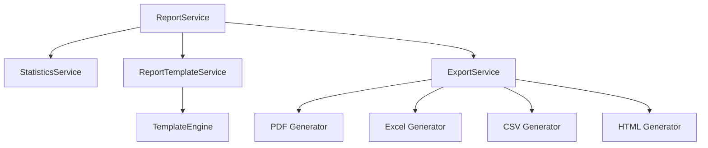

# Motor de Informes

Versión 1.0

---

## 1. Objetivo

Definir el sistema de generación de informes de la aplicación, que permite crear documentos formateados a partir de los datos registrados.

---

## 2. Tipos de informe

### Informe de partido

Resumen ejecutivo del partido con estadísticas clave.

### Informe detallado

Todas las posesiones, jugadoras, sistemas y tendencias.

### Informe de temporada

Evolución, comparativas, tendencias.

### Informe de scouting

Análisis del rival, sistemas y jugadoras clave.

### Informe de jugadora

Ficha completa de producción de una jugadora.

### Informe de quinteto

Rendimiento de combinaciones de jugadoras.

---

## 3. Arquitectura



---

## 4. ReportService

```typescript
@Injectable({ providedIn: 'root' })
export class ReportService {
  private readonly statsService = inject(StatisticsService);
  private readonly templateService = inject(ReportTemplateService);
  private readonly exportService = inject(ExportService);
  private readonly store = inject(ReportStore);

  readonly availableTemplates = signal<ReportTemplate[]>([]);
  readonly currentReport = signal<Report | null>(null);

  async generateMatchReport(matchId: string, templateId: string): Promise<Blob> {
    const stats = await this.statsService.getAllMatchStats(matchId);
    const template = this.templateService.getTemplate(templateId);

    const report = {
      title: `Informe de Partido - ${stats.match.rival}`,
      date: stats.match.date,
      stats: stats,
      sections: template.sections,
    };

    this.store.setCurrentReport(report);
    return this.exportService.generatePdf(report, template);
  }

  async generateSeasonReport(seasonId: string): Promise<Blob> {
    const seasonStats = await this.statsService.getSeasonStats(seasonId);
    const trends = await this.statsService.getSeasonTrends(seasonId);

    const report = {
      title: `Informe de Temporada`,
      stats: seasonStats,
      trends: trends,
      sections: this.templateService.getDefaultSeasonTemplate().sections,
    };

    return this.exportService.generatePdf(report, this.templateService.getDefaultSeasonTemplate());
  }
}
```

---

## 5. ReportTemplate

```typescript
interface ReportTemplate {
  id: string;
  name: string;
  description: string;
  sections: ReportSection[];
  layout: 'portrait' | 'landscape';
  pageSize: 'A4' | 'Letter';
  colors: {
    primary: string;
    secondary: string;
    accent: string;
  };
  logo?: string;
  footer?: string;
}

interface ReportSection {
  id: string;
  title: string;
  type: 'cover' | 'summary' | 'table' | 'chart' | 'text' | 'player-list' | 'possession-list';
  dataKey: string;
  config: Record<string, unknown>;
}
```

---

## 6. Plantilla de informe de partido

```typescript
const matchReportTemplate: ReportTemplate = {
  id: 'match-detailed',
  name: 'Informe detallado de partido',
  description: 'Informe completo con todas las estadísticas del partido',
  layout: 'portrait',
  pageSize: 'A4',
  colors: {
    primary: '#1e3a5f',
    secondary: '#64748b',
    accent: '#3b82f6',
  },
  sections: [
    {
      id: 'cover',
      title: 'Portada',
      type: 'cover',
      dataKey: 'match',
      config: { showDate: true, showScore: true },
    },
    {
      id: 'summary',
      title: 'Resumen ejecutivo',
      type: 'summary',
      dataKey: 'summary',
      config: { kpis: ['ppp', 'ortg', 'drtg', 'possessions'] },
    },
    {
      id: 'systems',
      title: 'Eficiencia por sistema',
      type: 'chart',
      dataKey: 'systems',
      config: { chartType: 'bar', showValues: true },
    },
    {
      id: 'players',
      title: 'Estadísticas de jugadoras',
      type: 'player-list',
      dataKey: 'players',
      config: { sortBy: 'points', columns: ['name', 'points', 'ppp', 'creations'] },
    },
    {
      id: 'possessions',
      title: 'Registro de posesiones',
      type: 'possession-list',
      dataKey: 'possessions',
      config: { groupBy: 'period', showTimeline: true },
    },
  ],
};
```

---

## 7. ExportService

```typescript
@Injectable({ providedIn: 'root' })
export class ExportService {
  async generatePdf(report: Report, template: ReportTemplate): Promise<Blob> {
    const html = this.renderToHtml(report, template);
    // Utilizar librería de PDF (jsPDF, Puppeteer, etc.)
    return html2pdf(html);
  }

  async generateExcel(data: Record<string, unknown>[], filename: string): Promise<Blob> {
    // Generar Excel desde datos tabulares
    return excelGenerator.generate(data);
  }

  async generateCsv(data: Record<string, unknown>[], filename: string): Promise<Blob> {
    const headers = Object.keys(data[0] ?? {});
    const rows = data.map(row => headers.map(h => row[h]).join(','));
    const csv = [headers.join(','), ...rows].join('\n');
    return new Blob([csv], { type: 'text/csv' });
  }

  private renderToHtml(report: Report, template: ReportTemplate): string {
    let html = this.generateHeader(template);
    for (const section of template.sections) {
      html += this.renderSection(section, report);
    }
    html += this.generateFooter(template);
    return html;
  }
}
```

---

## 8. Formato de salida de informes

| Formato | Uso | Librería sugerida |
|---------|-----|-------------------|
| PDF | Informes formales, impresión | jsPDF + html2canvas |
| HTML | Vista previa en navegador | Renderizado propio |
| Excel | Datos para análisis externo | SheetJS / xlsx |
| CSV | Exportación rápida | Generación manual |
| PNG | Compartir en redes | html2canvas |

---

## 9. Programación de informes

El sistema permitirá programar informes automáticos:

```typescript
interface ScheduledReport {
  id: string;
  templateId: string;
  teamId: string;
  frequency: 'after_match' | 'daily' | 'weekly' | 'monthly';
  recipients: string[];
  format: 'pdf' | 'html';
  nextRun?: string;
  lastRun?: string;
}
```

---

## 10. Personalización de informes

Cada entrenador puede:
- Seleccionar las secciones del informe
- Elegir el orden de las secciones
- Configurar colores corporativos
- Añadir logo del equipo
- Definir el pie de página
- Elegir qué KPIs incluir

---

## 11. Ejemplo de informe PDF generado

```text
┌─────────────────────────────────────────────┐
│                                             │
│            INFORME DE PARTIDO               │
│                                             │
│       CÁCERES 72 - 65 BADAJOZ              │
│          15 de marzo de 2026                │
│                                             │
├─────────────────────────────────────────────┤
│                                             │
│  RESULTADO: Cáceres 72 - 65 Badajoz        │
│  COMPETICIÓN: Liga Regular - Jornada 5     │
│  FECHA: 15/03/2026                         │
│                                             │
├─────────────────────────────────────────────┤
│  RESUMEN                                    │
│                                             │
│  PPP Ofensivo:    1.24                      │
│  PPP Defensivo:   1.05                      │
│  Offensive Rating: 124                      │
│  Defensive Rating: 105                      │
│  Posesiones:      58                        │
│                                             │
├─────────────────────────────────────────────┤
│  EFICIENCIA POR SISTEMA                      │
│                                             │
│  Horns   4 pos   6 pts   1.50 PPP           │
│  Flex    3 pos   3 pts   1.00 PPP           │
│  Spain   2 pos   3 pts   1.50 PPP           │
│  Delay   1 pos   2 pts   2.00 PPP           │
│                                             │
├─────────────────────────────────────────────┤
│  JUGADORAS DESTACADAS                        │
│                                             │
│  Marta García     18 pts   1.50 PPP  3 gen  │
│  Ana Pérez        15 pts   1.36 PPP  2 gen  │
│  Laura Sánchez    12 pts   1.20 PPP  1 gen  │
│                                             │
├─────────────────────────────────────────────┤
│  REGISTRO DE POSESIONES                      │
│                                             │
│  Q1-01  Propia   T2+  Marta   (Horns)    2  │
│  Q1-02  Rival    T3+  #7       (Flex)    3  │
│  ...                                        │
│                                             │
└─────────────────────────────────────────────┘
```

---

## 12. Decisiones de diseño

- Los informes se generan en el lado del cliente
- Las plantillas son configurables por equipo
- Los informes se pueden previsualizar antes de exportar
- La generación es asíncrona para informes grandes
- Los informes programados usan Edge Functions de Supabase

---

## Próximo documento

[15-motor-ia.md](15-motor-ia.md)
