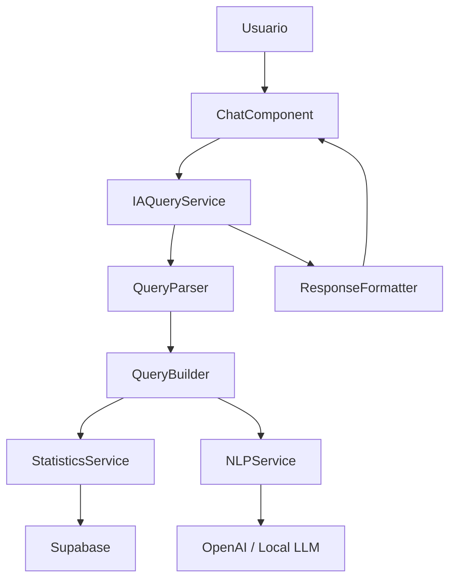

# Motor de Inteligencia Artificial

Versión 1.0

---

## 1. Objetivo

Definir el sistema de inteligencia artificial de la aplicación, que permite a los entrenadores obtener respuestas automáticas basadas en los datos registrados.

---

## 2. Filosofía

La IA no sustituye al entrenador.

La IA procesa los datos registrados y responde preguntas concretas.

Nunca alucina datos: solo responde con información real registrada en posesiones.

Todas las respuestas incluyen la fuente de datos.

---

## 3. Arquitectura



---

## 4. Tipos de consulta

### Consultas estadísticas

```text
Usuario: "¿Qué sistema da mejor PPP?"
Sistema: Calcula PPP por sistema, ordena, responde con datos
```

### Consultas comparativas

```text
Usuario: "¿Rendimos mejor en casa o fuera?"
Sistema: Compara métricas agrupadas por local/visitante
```

### Consultas de tendencias

```text
Usuario: "¿Está mejorando nuestro PPP en las últimas jornadas?"
Sistema: Calcula evolución, detecta tendencia, responde
```

### Consultas de scouting

```text
Usuario: "¿Cómo ataca Badajoz?"
Sistema: Analiza partidos contra Badajoz, resume patrones
```

### Consultas de jugadoras

```text
Usuario: "¿Quién genera más ventajas jugando con Marta?"
Sistema: Filtra posesiones donde ambas coinciden, calcula métricas
```

---

## 5. IAQueryService

```typescript
@Injectable({ providedIn: 'root' })
export class IAQueryService {
  private readonly queryParser = inject(QueryParser);
  private readonly queryBuilder = inject(QueryBuilder);
  private readonly statsService = inject(StatisticsService);
  private readonly store = inject(IAStore);

  readonly conversation = signal<Message[]>([]);
  readonly isProcessing = signal(false);

  async ask(question: string): Promise<void> {
    this.isProcessing.set(true);
    this.conversation.update(msgs => [...msgs, { role: 'user', content: question }]);

    try {
      const intent = this.queryParser.parseIntent(question);
      const query = this.queryBuilder.buildQuery(intent);
      const data = await this.executeQuery(query);
      const response = this.formatResponse(intent, data, question);

      this.conversation.update(msgs => [...msgs, { role: 'assistant', content: response }]);
    } catch (error) {
      const errorMsg = 'No he podido procesar esa pregunta. Intenta ser más específico.';
      this.conversation.update(msgs => [...msgs, { role: 'assistant', content: errorMsg }]);
    } finally {
      this.isProcessing.set(false);
    }
  }

  private parseIntent(question: string): QueryIntent {
    const normalized = question.toLowerCase();

    if (normalized.includes('qué sistema') || normalized.includes('mejor sistema'))
      return { type: 'system_efficiency', params: {} };

    if (normalized.includes('quién genera') || normalized.includes('genera más ventajas'))
      return { type: 'top_creators', params: {} };

    if (normalized.includes('cómo') && normalized.includes('contra'))
      return { type: 'opponent_analysis', params: this.extractOpponent(question) };

    if (normalized.includes('evolución') || normalized.includes('tendencia'))
      return { type: 'trend', params: this.extractMetric(question) };

    return { type: 'general_stats', params: {} };
  }

  private executeQuery(query: QueryIntent): Promise<QueryResult> {
    switch (query.type) {
      case 'system_efficiency':
        return this.statsService.getSystemEfficiency(query.params);
      case 'top_creators':
        return this.statsService.getTopCreators(query.params);
      case 'opponent_analysis':
        return this.statsService.getOpponentAnalysis(query.params);
      case 'trend':
        return this.statsService.getMetricTrend(query.params);
      default:
        return this.statsService.getGeneralStats(query.params);
    }
  }
}
```

---

## 6. QueryParser

```typescript
@Injectable({ providedIn: 'root' })
export class QueryParser {
  parseIntent(question: string): QueryIntent {
    const normalized = question.toLowerCase();

    // Detectar tipo de consulta
    if (this.matchesAny(normalized, ['sistema', 'sistemas', 'mejor sistema', 'peor sistema'])) {
      return { type: 'system_efficiency' };
    }

    if (this.matchesAny(normalized, ['generadora', 'genera', 'crea ventajas', 'asiste'])) {
      return { type: 'top_creators' };
    }

    if (this.matchesAny(normalized, ['quinteto', 'mejor quinteto', 'line up'])) {
      return { type: 'lineup_efficiency' };
    }

    if (this.matchesAny(normalized, ['contra', 'rival', 'oponente'])) {
      const opponent = this.extractOpponent(question);
      return { type: 'opponent_analysis', params: { opponent } };
    }

    if (this.matchesAny(normalized, ['evolución', 'tendencia', 'últimos', 'progreso'])) {
      const metric = this.extractMetric(question);
      return { type: 'trend', params: { metric } };
    }

    // Por defecto, responder con resumen general
    return { type: 'general_stats' };
  }

  private matchesAny(text: string, keywords: string[]): boolean {
    return keywords.some(k => text.includes(k));
  }

  private extractOpponent(question: string): string {
    // Extraer nombre del rival de la pregunta
    const patterns = [
      /contra\s+(\w+)/i,
      /cómo\s+juega\s+(\w+)/i,
      /analizar\s+a\s+(\w+)/i,
    ];

    for (const pattern of patterns) {
      const match = question.match(pattern);
      if (match) return match[1];
    }

    return '';
  }

  private extractMetric(question: string): string {
    const metrics = {
      'ppp': 'ppp',
      'puntos': 'points',
      'pérdidas': 'turnovers',
      'anotación': 'points',
      'ofensivo': 'offensive_rating',
      'defensivo': 'defensive_rating',
    };

    for (const [key, value] of Object.entries(metrics)) {
      if (question.includes(key)) return value;
    }

    return 'ppp';
  }
}
```

---

## 7. Ejemplos de interacción

```text
Usuario: ¿Qué sistema usamos más?
Asistente: El sistema más utilizado es Horns con un 35% de las posesiones (22 posesiones).
           Le sigue Flex con un 22% (14 posesiones) y Spain con un 18% (11 posesiones).

--- 

Usuario: ¿Qué jugadora genera más ventajas?
Asistente: Marta García es la jugadora que más ventajas genera con 12 generaciones
           en 5 partidos, seguida de Ana Pérez con 8 y Laura Sánchez con 6.
           El PPP cuando Marta genera es de 1.52.

---

Usuario: ¿Cómo defendemos el contraataque?
Asistente: Hemos recibido 18 contraataques en 5 partidos.
           PPP recibido en contraataque: 1.28 (por debajo de nuestra media defensiva de 1.35).
           El 42% de los contraataques recibidos acaban en T2 anotado.

---

Usuario: ¿Qué ocurre en los últimos 2 minutos?
Asistente: En los últimos 2 minutos de partidos ajustados (<10 pts):
           - PPP: 0.95 (por debajo de la media)
           - 35% pérdidas
           - Horns es el sistema más utilizado (60%)
           - Marta García finaliza el 70% de las posesiones
```

---

## 8. Interfaz de chat

```text
┌────────────────────────────────────────────┐
│  🤖 ASISTENTE TÁCTICO                       │
├────────────────────────────────────────────┤
│                                            │
│  ┌────────────────────────────────────────┐│
│  │ 🧑 ¿Qué sistema da mejor PPP?          ││
│  └────────────────────────────────────────┘│
│                                            │
│  ┌────────────────────────────────────────┐│
│  │ 🤖 Según los datos de esta temporada:  ││
│  │                                        ││
│  │ Spain es tu sistema más eficiente      ││
│  │ con 1.52 PPP en 18 posesiones.         ││
│  │                                        ││
│  │ Le sigue Horns con 1.35 PPP en         ││
│  │ 42 posesiones.                         ││
│  │                                        ││
│  │ 📊 [Mostrar gráfico]                   ││
│  └────────────────────────────────────────┘│
│                                            │
│  ┌────────────────────────────────────────┐│
│  │ 🧑 ¿Y cómo ataca Badajoz?              ││
│  └────────────────────────────────────────┘│
│                                            │
│  ┌────────────────────────────────────────┐│
│  │ 🤖 Basado en 3 partidos analizados:    ││
│  │                                        ││
│  │ Badajoz utiliza principalmente:        ││
│  │ • Horns (40%, 1.10 PPP)               ││
│  │ • Flex (25%, 1.20 PPP)                ││
│  │ • Spain (15%, 1.45 PPP)               ││
│  │                                        ││
│  │ Su jugadora clave es la #7 Ana Pérez   ││
│  │ (1.48 PPP, 60% de finalizaciones)      ││
│  │                                        ││
│  │ ⚠ Sufren presión en salida de balón    ││
│  └────────────────────────────────────────┘│
│                                            │
│  ┌──────────────────────────────────────┐  │
│  │ 💬 Escribe tu pregunta...           │  │
│  └──────────────────────────────────────┘  │
└────────────────────────────────────────────┘
```

---

## 9. QueryBuilder

```typescript
interface QueryIntent {
  type: QueryType;
  params: Record<string, unknown>;
}

type QueryType =
  | 'general_stats'
  | 'system_efficiency'
  | 'top_creators'
  | 'top_scorers'
  | 'lineup_efficiency'
  | 'opponent_analysis'
  | 'trend'
  | 'comparison'
  | 'player_analysis'
  | 'situation_analysis';
```

---

## 10. Preguntas sugeridas

El sistema muestra preguntas sugeridas para guiar al usuario:

```text
💡 Preguntas que puedes hacer:

📊 Estadísticas generales
  • ¿Cuál es nuestro PPP esta temporada?
  • ¿Qué sistema es más eficiente?
  • ¿Cómo rendimos en cada cuarto?

👤 Jugadoras
  • ¿Quién anota más puntos?
  • ¿Quién genera más ventajas?
  • ¿Qué jugadora es más eficiente?

⚔ Rivales
  • ¿Cómo ataca Badajoz?
  • ¿Qué debilidades tiene Mérida?
  • ¿Cómo defendemos a cada rival?

📈 Tendencias
  • ¿Estamos mejorando?
  • ¿Qué ha cambiado en los últimos partidos?
  • ¿Dónde perdemos más balones?
```

---

## 11. ResponseFormatter

```typescript
@Injectable({ providedIn: 'root' })
export class ResponseFormatter {
  formatSystemEfficiency(data: SystemStat[]): string {
    const sorted = data.sort((a, b) => b.ppp - a.ppp);
    const best = sorted[0];
    const worst = sorted[sorted.length - 1];

    let response = `**Sistema más eficiente:** ${best.name} con ${best.ppp} PPP (${best.possessionCount} posesiones).\n\n`;
    response += `**Sistema menos eficiente:** ${worst.name} con ${worst.ppp} PPP.\n\n`;
    response += `**Ranking completo:**\n`;

    for (const sys of sorted) {
      const bar = '█'.repeat(Math.round(sys.ppp * 10));
      response += `• ${sys.name}: ${sys.ppp} PPP ${bar}\n`;
    }

    return response;
  }

  formatTopCreators(data: PlayerCreationStat[]): string {
    const sorted = data.sort((a, b) => b.creations - a.creations);
    const top = sorted.slice(0, 3);

    let response = `**Top generadoras de ventaja:**\n\n`;

    for (let i = 0; i < top.length; i++) {
      response += `${i + 1}. **${top[i].name}** - ${top[i].creations} generaciones, ${top[i].pppGenerated} PPP generado\n`;
    }

    return response;
  }
}
```

---

## 12. Consideraciones de integración con LLM

Para consultas complejas, se puede utilizar un LLM externo:

```typescript
async function processWithLLM(question: string, context: MatchContext): Promise<string> {
  const prompt = `
Eres un asistente táctico de baloncesto.

Contexto del equipo:
- Último partido: ${context.match.rival} (${context.match.scoreOwn}-${context.match.scoreRival})
- PPP general: ${context.stats.ppp}
- Sistema más usado: ${context.stats.topSystem}

Pregunta del entrenador: "${question}"

Datos disponibles para responder:
${JSON.stringify(context.stats, null, 2)}

Responde de forma concisa y útil, basándote exclusivamente en los datos.
`;

  const response = await openai.chat.completions.create({
    model: 'gpt-4o-mini',
    messages: [{ role: 'user', content: prompt }],
    temperature: 0.3,
  });

  return response.choices[0]?.message?.content ?? '';
}
```

---

## 13. Privacidad de datos

- Los datos nunca salen de la base de datos del equipo
- El LLM solo recibe contexto agregado, no datos crudos
- El usuario puede desactivar la IA en cualquier momento
- No se almacenan conversaciones completas
- Las consultas a LLM externos son anónimas

---

## 14. Roadmap de IA

| Fase | Funcionalidad |
|------|---------------|
| 1 | Preguntas predefinidas con respuestas programáticas |
| 2 | Procesamiento de lenguaje natural básico |
| 3 | Integración con LLM para preguntas abiertas |
| 4 | Generación automática de informes narrativos |
| 5 | Recomendaciones tácticas basadas en datos |
| 6 | Detección proactiva de patrones |

---

## Próximo documento

[16-testing.md](16-testing.md)
