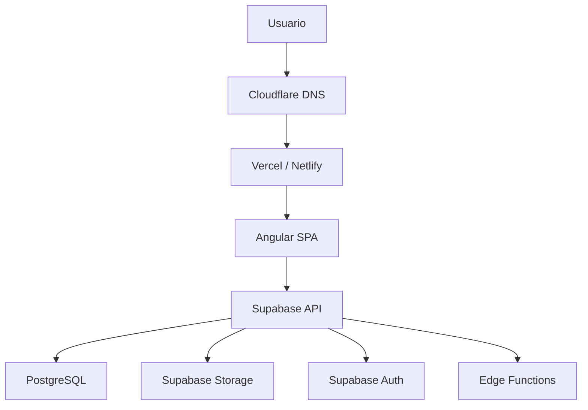

# Despliegue e Infraestructura

Versión 1.0

---

## 1. Objetivo

Definir la estrategia de despliegue, infraestructura y operaciones de la aplicación.

---

## 2. Arquitectura de despliegue



---

## 3. Stack de infraestructura

| Componente | Tecnología |
|------------|------------|
| Frontend | Angular SPA |
| Hosting | Vercel / Netlify |
| Base de datos | Supabase PostgreSQL |
| Autenticación | Supabase Auth |
| Almacenamiento | Supabase Storage |
| Funciones serverless | Supabase Edge Functions (Deno) |
| Dominio | propio (opcional) |
| CDN | Cloudflare / Vercel Edge Network |

---

## 4. Despliegue en Vercel

### Configuración

```json
// vercel.json
{
  "framework": "angular",
  "buildCommand": "npm run build",
  "outputDirectory": "dist/basket-coach",
  "rewrites": [
    {
      "source": "/(.*)",
      "destination": "/index.html"
    }
  ],
  "headers": [
    {
      "source": "/assets/(.*)",
      "headers": [
        {
          "key": "Cache-Control",
          "value": "public, max-age=31536000, immutable"
        }
      ]
    }
  ]
}
```

### Variables de entorno

```bash
# .env.production
NG_APP_SUPABASE_URL=https://your-project.supabase.co
NG_APP_SUPABASE_ANON_KEY=your-anon-key
NG_APP_VERSION=1.0.0
```

---

## 5. Despliegue en Netlify

```toml
# netlify.toml
[build]
  command = "npm run build"
  publish = "dist/basket-coach"

[[redirects]]
  from = "/*"
  to = "/index.html"
  status = 200
```

---

## 6. CI/CD Pipeline

```yaml
name: Deploy

on:
  push:
    branches: [main]

jobs:
  test:
    runs-on: ubuntu-latest
    steps:
      - uses: actions/checkout@v4
      - uses: actions/setup-node@v4
        with:
          node-version: 20
      - run: npm ci
      - run: npm run lint
      - run: npm run test -- --coverage

  deploy:
    needs: test
    runs-on: ubuntu-latest
    steps:
      - uses: actions/checkout@v4
      - uses: actions/setup-node@v4
        with:
          node-version: 20
      - run: npm ci
      - run: npm run build
      - uses: amondnet/vercel-action@v25
        with:
          vercel-token: ${{ secrets.VERCEL_TOKEN }}
          vercel-org-id: ${{ secrets.VERCEL_ORG_ID }}
          vercel-project-id: ${{ secrets.VERCEL_PROJECT_ID }}
          vercel-args: '--prod'
```

---

## 7. Base de datos

### Migraciones

Todas las migraciones se gestionan con Supabase CLI:

```bash
# Inicializar migraciones
supabase init

# Crear nueva migración
supabase migration new add_possessions_table

# Aplicar migraciones
supabase db push

# Generar tipos TypeScript
supabase gen types typescript --local > src/types/database.types.ts
```

### Estrategia de migraciones

- Cada cambio de esquema es una migración
- Las migraciones son reversibles
- Se prueban en rama de desarrollo
- Se aplican a producción mediante CI/CD

---

## 8. Edge Functions

Las funciones serverless se despliegan con Supabase CLI:

```bash
# Crear función
supabase functions new export-report

# Desplegar
supabase functions deploy export-report

# Probar localmente
supabase functions serve export-report
```

---

## 9. Entornos

| Entorno | Propósito | URL |
|---------|-----------|-----|
| Development | Desarrollo local | `localhost:4200` |
| Preview | PR preview | `pr-*.app.vercel.app` |
| Staging | Tests de integración | `staging.app.com` |
| Production | Usuarios finales | `app.com` |

---

## 10. Monitorización

### Supabase

- Logs de base de datos
- Consultas lentas
- Uso de almacenamiento
- Errores de autenticación

### Vercel Analytics

- Tiempo de carga
- Errores de frontend
- Rendimiento de rutas
- Geolocalización de usuarios

### Logs de aplicación

```typescript
// Servicio de logging
@Injectable({ providedIn: 'root' })
export class LoggingService {
  logError(error: Error, context?: string): void {
    console.error(`[${context ?? 'app'}]`, error);

    // Enviar a servicio externo (Sentry, LogRocket...)
    if (environment.production) {
      sentry.captureException(error, { tags: { context } });
    }
  }

  logEvent(event: string, data?: Record<string, unknown>): void {
    if (environment.production) {
      analytics.track(event, data);
    }
  }
}
```

---

## 11. Backup

Supabase proporciona backups automáticos:
- Diarios para proyectos Pro
- Punto de restauración (Point-in-Time Recovery)
- Exportación manual mediante `pg_dump`

```bash
# Backup manual
pg_dump --dbname=postgresql://... > backup_$(date +%Y%m%d).sql

# Restaurar
psql --dbname=postgresql://... < backup.sql
```

---

## 12. Escalabilidad

### Frontend

- CDN global (Vercel Edge Network)
- Compresión Brotli
- Lazy loading de módulos
- Caché de assets estáticos

### Base de datos

- Índices optimizados
- Vistas materializadas (futuro)
- Read replicas (futuro)
- Connection pooling

### Storage

- CDN para vídeos e imágenes
- Compresión automática
- Límites por bucket

---

## 13. Plan de recuperación ante desastres

| Escenario | Acción | Tiempo objetivo |
|-----------|--------|-----------------|
| Caída de Vercel | DNS failover a Netlify | < 5 min |
| Caída de Supabase | Restaurar desde backup | < 30 min |
| Error crítico frontend | Rollback a versión anterior | < 10 min |
| Pérdida de datos | Restaurar desde PITR | < 1 hora |

---

## 14. Costes estimados

| Servicio | Plan | Coste mensual |
|----------|------|---------------|
| Vercel | Pro (equipo pequeño) | $20 |
| Supabase | Pro | $25 |
| Dominio | .com | $1/mes |
| **Total** | | **~$46/mes** |

---

## Próximo documento

[19-decisiones-arquitectura.md](19-decisiones-arquitectura.md)
