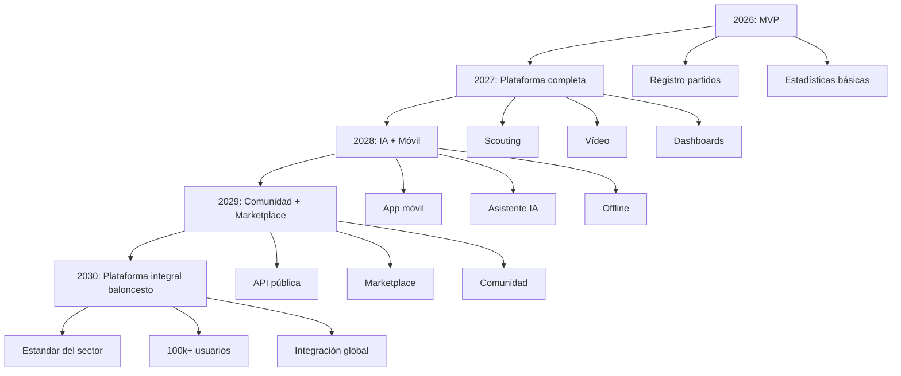

# Futuras Mejoras y Visión de Producto

Versión 1.0

---

## 1. Objetivo

Este documento recopila las mejoras futuras y la visión a largo plazo de la aplicación, más allá del roadmap principal.

---

## 2. Módulos planeados

### 2.1 Pizarra táctica

Pizarra digital interactiva para diseñar jugadas.

Funcionalidades:
- Dibujar movimientos de jugadoras
- Animar secuencias
- Guardar jugadas en biblioteca
- Asociar jugadas a sistemas
- Compartir jugadas con el equipo
- Modo presentación

### 2.2 Módulo de entrenamientos

Planificación y seguimiento de entrenamientos.

Funcionalidades:
- Crear sesiones de entrenamiento
- Planificar ejercicios
- Registrar asistencias
- Evaluar rendimiento en entrenamientos
- Comparar rendimiento partido vs entrenamiento
- Carga de trabajo

### 2.3 Scouting avanzado

Scouting con análisis de vídeo y tendencias.

Funcionalidades:
- Anotaciones sobre vídeo rival
- Patrones de juego detectados automáticamente
- Base de datos de rivales
- Histórico de enfrentamientos
- Preparación de informes pre-partido

### 2.4 Comunidad

Plataforma social para entrenadores.

Funcionalidades:
- Compartir sistemas y jugadas
- Biblioteca de configuraciones
- Rankings públicos (opcional)
- Foros de discusión
- Intercambio de scouting

### 2.5 Marketplace

Tienda de configuraciones y plantillas.

Funcionalidades:
- Plantillas de dashboards
- Packs de sistemas tácticos
- Informes predefinidos
- Temas visuales

---

## 3. Mejoras de plataforma

### 3.1 Aplicación móvil nativa

- iOS y Android
- Cámara para captura de vídeo
- Offline first
- Sincronización en segundo plano
- Notificaciones push
- Widgets de estadísticas rápidas

### 3.2 Modo offline

- Registro de posesiones sin conexión
- Los datos se almacenan en IndexedDB
- Sincronización automática al recuperar conexión
- Resolución de conflictos
- Prioridad: datos locales

### 3.3 Soporte multilingüe

- i18n completo
- Español, inglés, francés, italiano, portugués
- Traducción de catálogos configurables
- Interfaz adaptada al idioma del usuario

### 3.4 API pública

- API REST para integraciones externas
- Webhooks para eventos
- SDK para desarrolladores
- Documentación interactiva (Swagger)
- Límites de tasa

---

## 4. Mejoras de IA

### 4.1 Asistente táctico avanzado

- Recomendaciones en tiempo real durante el partido
- Detección de patrones del rival
- Sugerencias de ajustes tácticos
- Análisis predictivo de posesiones
- Simulaciones de estrategias

### 4.2 Generación automática de informes narrativos

- La IA escribe informes en lenguaje natural
- Destaca fortalezas y debilidades
- Genera recomendaciones personalizadas
- Adapta el tono al destinatario (entrenador, jugadoras, prensa)

### 4.3 Reconocimiento de vídeo

- Detección automática de posesiones en vídeo
- Reconocimiento de sistemas tácticos
- Seguimiento de jugadoras
- Generación automática de clips destacados
- Estadísticas visuales automáticas

---

## 5. Mejoras de integración

### 5.1 Integración con wearables

- Importar datos de dispositivos GPS
- Sincronizar frecuencia cardíaca
- Carga física por jugadora
- Correlación entre carga física y rendimiento

### 5.2 Integración con marcadores electrónicos

- Conexión con marcadores de pabellón
- Sincronización automática de resultado
- Actualización de actas oficiales
- Integración con FEB / FIBA

### 5.3 Integración con plataformas de vídeo

- YouTube / Vimeo para alojar vídeos
- Hudl para intercambio de scouting
- Synergy Sports para datos avanzados
- FastModel para pizarra táctica

---

## 6. Mejoras de UX/UI

### 6.1 Experiencia onboarding

- Tutorial interactivo al primer inicio
- Configuración guiada del equipo
- Ejemplos de registro de posesiones
- Demo con datos de ejemplo

### 6.2 Gamificación

- Insignias por hitos alcanzados
- Estadísticas personales del entrenador
- Retos semanales
- Rankings entre entrenadores del club

### 6.3 Accesibilidad

- WCAG 2.1 AA
- Contraste suficiente
- Navegación por teclado
- Lectores de pantalla
- Modo de alto contraste

---

## 7. Mejoras de negocio

### 7.1 Modelo de suscripción

| Plan | Precio | Características |
|------|--------|-----------------|
| Free | Gratis | 1 equipo, 10 partidos/mes |
| Pro | $9.99/mes | 3 equipos, ilimitado |
| Team | $29.99/mes | 10 equipos, multi-entrenador |
| Club | $99.99/mes | Ilimitado, API, soporte prioritario |

### 7.2 White label

- Personalización completa de marca
- Dominio propio
- Logo y colores corporativos
- Soporte dedicado

### 7.3 On-premise

- Despliegue en servidores del club
- Control total de datos
- Personalización extrema
- SLA garantizado

---

## 8. Visión a 5 años

---

## 9. Tecnologías futuras a considerar

| Tecnología | Potencial uso |
|------------|---------------|
| WebAssembly | Procesamiento de vídeo en cliente |
| WebRTC | Streaming en tiempo real |
| WebGPU | Renderizado 3D pizarra táctica |
| TensorFlow.js | ML en navegador |
| Capacitor | App móvil híbrida |
| PWA | Instalación en dispositivo |
| GraphQL | API flexible |
| RabbitMQ | Cola de procesamiento |

---

## 10. Feedback y evolución

El producto evolucionará en función de:

- Feedback real de entrenadores
- Datos de uso anónimos
- Solicitudes de funcionalidades
- Tendencias del sector
- Innovaciones tecnológicas

---

## 11. Principios de evolución

- Cada nueva funcionalidad debe compartir la arquitectura existente
- No añadir funcionalidades que no puedan probarse con usuarios reales
- La simplicidad de uso es más importante que la cantidad de funciones
- Los datos siempre pertenecen al entrenador y su equipo
- El producto debe funcionar independientemente del nivel técnico del usuario

---

## 12. Fin del documento

Este documento completa la serie de especificaciones del proyecto.

La documentación completa consta de 20 documentos que cubren:
- Especificación funcional
- Modelo de datos
- Arquitectura
- UX/UI
- Módulos específicos
- IA
- Testing
- Seguridad
- Despliegue
- Decisiones arquitectónicas
- Visión futura

---

**[Volver al índice](INDEX.md)**
